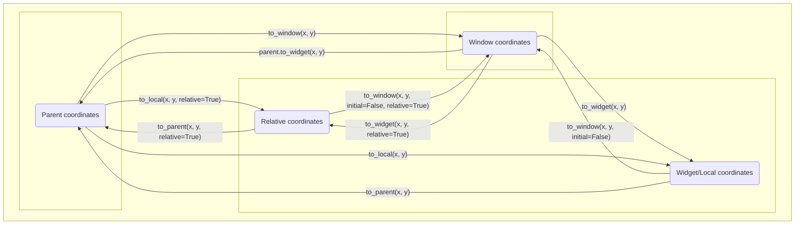

# Kivy notes
This README contains documentation about some odds and ends of Kivy but the official documentation does not describe in a satisfactory manner.

Chapters:
- [GridLayouts in too much Detail](#kivy-gridlayouts-in-too-much-detail)
- [Kivy Coordinates](#kivy-coordinates)


# Kivy GridLayouts in too much detail
[Back to title](#kivy-notes)

Useful facts:
 - Rows are 0-indexed, so row 0 is the first row, row 1 is the second row, etc. No matter the orientation of the GridLayout (`tb-lr`, `bt-lr`, etc), the topmost row is row 0.
 - GridLayouts create slots for each of their child widgets. The slots have the same height for every row. Widgets are placed in the bottom left of each slot. 
 - If the widget has a value for `size_hint_y` that is not `None`, then it will take the full height of the slot. If the `size_hint_y` is `None`, then it is possible for the widget to take less than or more than the height of the slot.
 - GridLayouts calculate a minimum height for each of its rows. The GridLayout ensures that the height of the slots in each row is at least the minimum height, even if the sum of minimum heights exceeds the height of the GridLayout. The GridLayout will even draw its children outside of the Window if it has to.
 -  When keeping track of these behaviors, it is extremely useful to remember the following default values for properties of GridLayouts and widgets:
    - GridLayout:
      - `force_row_default`: `False`
      - `rows_minimum`: `{}`
      - `row_height_default`: 0
    - Widget:
      - `size_hint`: `(1, 1)`
        - And consequently, `size_hint_y`: `1`
      - `size`: `(100, 100)`
        - And consequently, `height`: `100`

The process:
 - If `cols` is `None` and `rows` is `None`:
   - The GridLayout does not manage the positions and sizes of its children. The `size_hint` attribute of any child of the GridLayout has no effect. 
 - If `force_row_default` set to `True`:
   - The the height of the slots for row `n` is determined by the keys in `rows_minimum`.
     - if `rows_minimum` contains the key `n`:
       - Then the height of the slots for row `n` is set to the value mapped by `n` in `rows_minimum`. 
     - If `rows_minimum` does not contain a key for `n`:
       - Then the height of the slots for row `n` is the value of `row_height_default`.
   - The slot height is now determined for every row. The children are then placed in the bottom left of each slot.
     - If the child has any non-`None` value for `size_hint_y`:
       - Then the child will fill the entire height of the slot.
     - If a child in row `n` has a `size_hint_y` set to `None`:
       - Then the GridLayout allows the user to determine the widget height. And value you assign to the `height` attribute becomes the height of the widget.
       - If `height` is less than the height of the slot, then the widget will not fill the entire vertical space of the slot.
       - If the `height` exceeds the height of the slot, then the widget will exceed the space of the slot.
   
 - If `force_row_default` is set to `False`:
   - The slot height for each row is the sum of the "minimum height" calculated for that row and a fraction of the "allotted height" for that row.
     - Minimum Height:
       - The GridLayout finds the largest of the following three values for the `n`th row and sets that value as the minimum height of that row.
         - If the key `n` exists in `rows_minimum`, then it uses the value mapped by `n`. If the key `n` is not in `rows_minimum`, then negative infinity.
         - If at least one child in the `n`th row has a `size_hint_y` set to `None`, then it uses the maximum height of every one of these children. If there are no children with a `size_hint_y` set to `None` in the `n`th row, then negative infinity.
         - The value of `row_height_default`.
     - Allotted Height:
       - The GridLayout determines the allotted height for each row by subtracting the following values from the height of the GridLayout:
         - The padding_top of the GridLayout (`padding[1]`)
         - The padding_bottom of the GridLayout (`padding[3]`)
         - The spacing between each row (`spacing[1]` * (number of rows - 1))
         - The sum of minimum heights for each row
       - If the allotted height is 0 or less than zero:
         - The slot height for every child in that row is just the minimum height and nothing more.
       - If the allotted height is greater than 0:
         - If every widget in the `n`th row has a `size_hint_y` with a value of `None`:
           - The slot height for every child in that row is just the minimum height and nothing more.
         - If at least one widget in row `n` has a non-`None` `size_hint_y`:
           - The GridLayout determines the maximum `size_hint_y` for every row which contains at least one child with a non-`None` `size_hint_y`.
           - The GridLayout sums of all maximum `size_hint_y`'s.
           - The GridLayout calculates the ratio of the maximum `size_hint_y` in row `n` to the sum of all maximum `size_hint_y`'s.
           - The GridLayout multiplies this ratio by the allotted height and adds that to the minimum height of row `n`.
    - The slot height is now determined for every row. The children are then placed in the bottom left of each slot.
      - If the child has a value of `size_hint_y` that is not `None`:
        - The child will take the full vertical space of the slot.
      - If a child has a `size_hint_y` whose value is `None`:
        - Then the GridLayout allows the user to determine the widget height. Any value you assign to the `height` attribute becomes the height of the widget.
        - Note that the `height` parameter will never exceed the height of the slot. If you review the process for how the slot height is calculated when `force_row_default` is `False`, you will see that the slot height for that row will increase to contain the widget if you try to increase the widget height beyond the slot height.
 
The behavior of widths and columns follows in the natural way. Just copy-paste what is written above, but replace every "row" with "column", every `row` with `col`, every "height" with "width", every "vertical" with "horizontal", and so on.

# Kivy Coordinates
[Back to title](#kivy-notes)

Subsections:
- [Defining the coordinate systems](#defining-the-coordinate-systems)
- [Consequences of the definitions](#consequences-of-the-definitions)
- [Coordinate transformation API](#coordinate-transformation-api)
- [Converting coordinates between widgets](#converting-coordinates-between-widgets)

### Defining the coordinate systems
[Back to chapter start](#kivy-coordinates)

[Back to title](#kivy-notes)

The `pos` attribute of a Kivy widget refers to the (`x`, `y`) position of the bottom-left corner of that widget. Typically, the origin of this coordinate system is the bottom-left corner of the containing window. Coordinates in this coordinate system are said to be in **window coordinates**. 

However, there are four “special” widgets which change the origin of the coordinate system for their children. These widgets are 

 - RelativeLayout 
 - ScrollView 
 - Scatter 
 - ScatterLayout 

To discuss this in detail, let us introduce the term “parent stack.” For example, if the root kv file of a Kivy application looked like the following: 

```kvlang
BoxLayout: 
    BoxLayout: 
        AnchorLayout: 
            BoxLayout: 
                Widget: 
```
 

Then `Widget`’s parent stack would be `BoxLayout`, `AnchorLayout`, `BoxLayout`, `BoxLayout`. `AnchorLayout`’s parent stack would be `BoxLayout`, `BoxLayout`. Note that the parent stack is ordered. 

Now, if the parent stack of a widget (let’s call it `widget_a`) includes one of the four special widgets, then `widget_a` adopts a new coordinate system. This new coordinate system has an origin located at the bottom-left corner of the first “special” widget in `widget_a`’s parent stack. 

Now we introduce the term **parent coordinates**. The parent coordinates of `widget_a` depend on whether `widget_a` has a special widget in its parent stack.  

 - If `widget_a` does not have a special widget in its parent stack: 
   - Then `widget_a`’s parent coordinates are equivalent to window coordinates. 
 - If `widget_a` has a special widget in its parent stack: 
   - Then the origin of the parent coordinates for `widget_a` is located at the bottom-left corner of the first special widget in `widget_a`’s parent stack. 

**It is crucial to understand that the pos attribute of a widget is in the parent coordinates of that widget.**

The Kivy docs do not mention this, but there is another coordinate system that they use. We will call it **relative coordinates**. The origin of the relative coordinates of `widget_a` is located at the bottom left of `widget_a`. 

Kivy uses one other coordinate system which is referred by two names: **widget coordinates / local coordinates**. The widget/local coordinates of `widget_a` are the parent coordinates of the immediate children of `widget_a` (when we say "immediate children", we are excluding its grandchildren, great-grandchildren, and so on). Most of the time, a widget's widget/local coordinate system is the same as its parent coordinate system. But if a widget is a "special" widget, then its widget/local coordinate system is the same as its relative coordinate system.

Window coordinates are an absolute coordinate system. The position (x, y) in window coordinates is the same point on the screen for every widget in a running application. However, parent coordinates, widget/local coordinates, and relative coordinates are always in reference to a particular widget. In other words, each widget has its own parent, widget/local, and relative coordinate system that may have a different origin from that of another widget. 

In summary:
 - **window coordinates**: The coordinate system whose origin is the bottom left of the application window. This coordinate system is the same for all widgets.
 - **parent coordinates**: Every widget has its own parent coordinates. If `widget_a` has one of the four "special" widgets (RelativeLayout, Scatter, ScatterLayout, ScrollView) in its parent stack, then the origin of the parent coordinates of `widget_a` is located at the bottom left of the first special widget in `widget_a`'s parent stack. If `widget_a` does not have any "special" widgets in its parent stack, then its parent coordinates have the same origin as the application's window coordinates. The `pos` attribute of a widget is in that widget's parent coordinates (as are the `x` and `y` attributes).
 - **relative coordinates**: Every widget has its own relative coordinates. The origin of `widget_a`'s relative coordinates is located at the bottom-left of `widget_a`.
 - **widget/local coordinates**: Every widget has its own widget/local coordinates. The widget/local coordinates of `widget_a` are the parent coordinates of the immediate children of `widget_a`. This means that if `widget_a` is a "special" widget, then the origin of its widget/coordinates is the same as that of its relative coordinates. If `widget_a` is not a "special" widget, then the origin of its widget/local coordinates is the same as its parent coordinates.

### Consequences of the definitions
[Back to chapter start](#kivy-coordinates)

[Back to title](#kivy-notes)

- It is interesting to notice that, if there are no special widgets in the application, then window coordinates, widget/local coordinates, and parent coordinates for all widgets have the same origin. 
- It is also interesting to notice that the widget/local coordinates of the immediate parent of `widget_a` are the same as the parent coordinates of `widget_a`. That is, given 

```kvlang
BoxLayout: 
    Widget: 
        id: widget_parent 
        Widget: 
            id: widget_a
```

the widget/local coordinate system of the widget with id `widget_parent` has the same origin as the parent coordinate system of `widget_a`. 
 - It is also interesting to notice that, if `widget_a` is a special widget, then its relative coordinates and widget/local coordinates are the same. 

 

### Coordinate transformation API
[Back to chapter start](#kivy-coordinates)

[Back to title](#kivy-notes)

Every widget has an API for converting positions to different coordinate systems. The methods are defined in the widget class and always take at least two arguments (`x` and `y`). The following image represents the API diagrammatically. A more precise description of the API will follow.



`to_local(x, y, relative=False)` 

 - If `relative` is set to `False` (the default value): 
   - `x`, `y` are assumed to be in the parent coordinates of the widget which calls the method. It returns a tuple that converts this position into widget/local coordinates of the widget which calls the method. 
 
For example, `widget_a.to_local(*widget_a.pos)` converts `widget_a`’s position into its local coordinates. (Remember that the pos attribute of a widget is always in that widget's parent coordinates). 

 - If `relative` is set to `True`: 
   - `x`, `y` are assumed to be in the parent coordinates of the widget which calls the method. Then the returned tuple will be in relative coordinates of the widget which calls the method. 

 

`to_parent(x, y, relative=False)` 

 - If `relative` is set to `False` (the default value): 
   - `x`, `y` are assumed to be in the local coordinates of the widget which calls the method. It returns a tuple that is this position in the parent coordinates of the widget which calls the method. 
 - If `relative` is set to `True`: 
   - `x`, `y` are assumed to be relative coordinates of the widget which calls the method. It returns a tuple that is this position in the parent coordinates of the widget which calls the method. 


`to_widget(x, y, relative=False)`
 - If `relative` is set to `False` (the default value):
   - `x`, `y` are assumed to be in window coordinates. It returns a tuple that is this position in the widget/local coordinates of the widget which calls the method. 
 - If `relative` is set to `True`:
   - `x`, `y` are assumed to be in window coordinates. It returns a tuple that is this position in the relative coordinates of the widget which calls the method.


`to_window(x, y, initial=True, relative=False)`
 - If `initial` is set to `True` (the default value): 
   - `x`, `y` are assumed to be in parent coordinates of the widget which calls the method. It returns a tuple that is this position in window coordinates. 
 - If `initial` is set to `False`: 
   - If `relative` is set to `False` (the default value): 
     - `x`, `y` are assumed to be in widget/local coordinates of the widget which calls the method. It returns a tuple that is this position in window coordinates. 
   - If `relative` is set to `True`: 
     - `x`, `y` are assumed to be in the relative coordinates of the widget which calls the method. It returns a tuple that is this position in window coordinates. 
 - What are we to make of the case where `initial` is `True` and `relative` is `True`? 
   - If we inspect Kivy’s source code, `widget_a.to_window(x, y, initial=True, relative=True)` is equivalent to calling `widget_a.parent.to_window(x, y, initial=False, relative=True)`. 
   - That is, `x`, `y` are assumed to be in the relative coordinates of the direct parent of the widget which calls the method. It returns a tuple that is this position in window coordinates. 
   - Never do this. If you ever need this very specific conversion, just use `widget_a.parent.to_window(x, y, initial=False, relative=True)`, which is more declarative.


`parent.to_widget(x, y)`
 - `x`, `y` are assumed to be in window coordinates. It returns a tuple that converts this position into the parent coordinates of the widget which calls the method.
   - For example, `widget_a.pos = widget_a.parent.to_widget(Window.width/2, Window.height/2)` places the bottom-left corner of `widget_a` in the center of the application.
   - This hack works because, as mentioned in [the previous chapter](#consequences-of-the-definitions), the widget/local coordinates of a parent has the same origin as the parent coordinates of its child.


### Converting coordinates between widgets
[Back to chapter start](#kivy-coordinates)

[Back to title](#kivy-notes)

It is a code smell if one widget directly accesses the position of another widget. For example, the following code attempts to place `widget_b` directly next to `widget_a`. 

```kvlang
Widget:
    RelativeLayout:
    	id: rl
        Widget: 
            id: a
    Widget:
        id: b
	# attempt to put b directly right of a
        pos: a.x + a.width, a.y 
```
 
However, the `pos` attribute (and the `x` and `y` attributes) of `a` and `b` are in different coordinate systems because `a` is in a `RelativeLayout` (one of the “special” widgets) while `b` is not. This may not place `b` in the expected location. 

You might then ask how one widget may safely access the position of the widget. But before doing this in an actual application, please consult the following checklist.

- Do you really need to access the position of another widget directly? With a proper widget tree, this is rarely ever necessary.
- Double check that you really must access the widget's position directly.
- Triple-check that you really must access the widget's position directly.

If you are confident that you must do this, then read on. However, there are lots of subtleties required to do this robustly.

You'd *think* that the answer is simple. Just convert the other widget's coordinates into window coordinates, and then convert those window coordinates into the parent coordinates of the current widget. For example,

```python
widget_a = Widget()
widget_b = Widget()

a_pos_in_window_coords = widget_a.to_window(*widget_a.pos)
a_pos_in_parent_coords_of_b = widget_b.parent.to_widget(*window_coords)

widget_b.pos = b_parent_coords  # naive!
```

However, if `widget_a` changes its position, then `widget_b` should also move. So we might then try

```python
widget_a = Widget()
widget_b = Widget()

def update_b_pos(*args):
    a_pos_in_window_coords = widget_a.to_window(*widget_a.pos)
    a_pos_in_parent_coords_of_b = widget_b.parent.to_widget(*window_coords)
    widget_b.pos = b_parent_coords 

widget_a.bind(pos=update_b_pos, size=update_b_pos)  # naive!
```

However, it is possible for `widget_a` to change its position in window coordinates without changing its `pos` or `size` attributes. For example, if `widget_a` is a child of a `RelativeLayout` then it will change its position in window coordinates whenever the position of the `RelativeLayout` changes. This can even happen if the size of the RelativeLayout changes (for example, suppose the RelativeLayout is anchored to the right of some boundary and then `widget_a`'s `pos` attribute is `0, 0`). 

So the correct strategy for placing `widget_b` directly on top of `widget_a` is as follows:
 - initialize our two widgets `widget_a` and `widget_b`
 - place them in the widget tree
 - find the "special" parent of `widget_a`, if it has one
 - create a method which converts `widget_a`'s position into the parent coordinates of `widget_b` and then assigns `widget_b.pos` to that value
 - bind this method to changes in `widget_a`'s pos, size, as well as to changes to the pos and size of the special parent of `widget_a`

For example,

```python
from kivy.core.window import Window

widget_a = Widget()
widget_b = Widget()

# do stuff and place widget_a and widget_b in the widget tree

# find widget_a's special parent
def find_special_parent_of(event_dispatcher, initial=True):
    # start crawling widget tree, starting at widget's parent
    if initial:
        find_special_parent_of(event_dispatcher.parent, initial=False)
    
    # base case
    if event_dispatcher:
        return event_dispatcher

    if (
    isinstance(event_dispatcher, RelativeLayout) or
    isinstance(event_dispatcher, ScrollView) or
    isinstance(event_dispatcher, Scatter) or
    isinstance(event_dispatcher, ScatterLayout)):
        return event_dispatcher

    find_special_parent_of(event_dispatcher.parent, initial=False)

special_parent = find_special_parent_of(widget_a)

def update_b_pos(*args):
    a_pos_in_window_coords = widget_a.to_window(*widget_a.pos)
    a_pos_in_parent_coords_of_b = widget_b.parent.to_widget(*window_coords)
    widget_b.pos = b_parent_coords

widget_a.bind(pos=update_b_pos, size=update_b_pos)
special_parent.bind(size=update_b_pos)

if special_parent is not Window:
    special_parent.bind(pos=update_b_pos)
```

What if we want to assign positions directly in kvlang? To start, it will be helpful to create the following utility function:

```python
def convert_pos(*, input, output):
    window_coords = input.to_window(*input.pos)
    output_parent_coords = output.parent.to_widget(*window_coords)
    
    return output_parent_coords
```

For example, `pos_in_b = convert_pos(input=a, output=b)` returns a list such that `pos_in_b[0]` returns the x value of the converted coordinates and `pos_in_b.[1]` returns the y value of the converted coordinates. However, I will also suggest making the following simple change:

```python
from kivy.vector import Vector

def convert_pos(*, input, output):
    window_coords = input.to_window(*input.pos)
    output_parent_coords = output.parent.to_widget(*window_coords)
    
    # kivy Vectors are a subclass of Python lists.
    return Vector(output_parent_coords)
```

With this change, then `pos_in_b = convert_pos(input=a, output=b)` returns a Vector describing the position of `a` in the parent coordinates of `b` and sets the variable `pos_in_b` to a Vector representing this position. `pos_in_b[0]` or `pos_in_b.x` returns the x value of the converted coordinates and `pos_in_b[1]` or `pos_in_b.y` returns the y value of the converted coordinates.

Kivy Vectors are a subclass of Python lists. Therefore, you can treat the return value of `convert_pos` as a list if you want. However, by making it a Vector, we add additional conveniences that an experienced user can choose to take advantage of if they want.

We will also make one more alteration to this method. The reason for this will be clear in a moment.

```python
from kivy.vector import Vector

def convert_pos(*, input, output, bind):
    """
    Takes the pos attribute of input and returns a Vector representing
    that position in the parent coordinates of output.
    
    The bind keyword does not affect the behavior of this function but 
    instead allows one to declaratively create bindings in kvlang.
    """
    window_coords = input.to_window(*input.pos)
    output_parent_coords = output.parent.to_widget(*window_coords)
    
    return Vector(output_parent_coords)
```

The reason for introducing the `bind` keyword in the argument list is to allow the user to create the relavant bindings when using `convert_pos` in kvlang. For example, the following code places one widget directly to the right of another.

```kvlang
#: import convert_pos utils.convert_pos

Widget:
    RelativeLayout:
    	id: rl
        Widget: 
            id: a
    Widget:
        id: b
	pos: convert_pos(input=a, output=b, bind=[a.pos, a.size, rl.pos, rl.size]) + (a.width, 0)
	
	# if convert_pos were an ordinary list, not a kivy Vector, we would have to do
	# pos: convert_pos(input=a, output=b, bind=[a.pos, a.size, rl.pos, rl.size])[0] + a.width, convert_pos(input=a, output=b, bind=[a.pos, a.size, rl.pos, rl.size])[1]
	
	# or equivalently,
	# x: convert_pos(input=a, output=b, bind=[a.pos, a.size, rl.pos, rl.size])[0] + a.width
	# y: convert_pos(input=a, output=b, bind=[a.pos, a.size, rl.pos, rl.size])[1]
```

Of course, instead of introduction a bind keyword, we could create the signature `convert_pos(*args, input, output)` and just pass whatever positional parameters are necessary. But the former method is more declarative.

All of this was pretty involved and deserves a replicable example. To do so, create the project structure

```
my_project/
  main.py
  utils.py
```

Place the code snippet defining `convert_pos` in utils.py. Then in main.py,

```python
from kivy.app import App
from kivy.core.window import Window
from kivy.lang import Builder
from kivy.modules import inspector
from kivy.properties import ColorProperty
from kivy.properties import ObjectProperty
from kivy.uix.label import Label
from kivy.uix.relativelayout import RelativeLayout
from kivy.uix.scatter import Scatter
from kivy.uix.scatterlayout import ScatterLayout
from kivy.uix.scrollview import ScrollView

from utils import convert_pos


class ColoredBox(Label):
    bg_color = ColorProperty(None)


class ColoredBoxBindingsInPython(ColoredBox):
    """This widget sets it pos property so that is placed directly to the right of self.widget_to_left."""
    widget_to_left = ObjectProperty(None)
    special_parent = ObjectProperty(None)

    def _update_pos(self, *args):
        widget_to_left = self.widget_to_left
        if widget_to_left is not None:
            left_pos = convert_pos(input=widget_to_left, output=self)
            self.pos = left_pos + (widget_to_left.width, 0)
    
    def _find_special_parent(event_dispatcher, initial=True):
    	"""Recursively crawls up the widget tree to find the first special parent of the given event dispatcher."""
        if initial:
            self._find_special_parent(event_dispatcher.parent, initial=False)

        if event_dispatcher is Window:
	    self._find_special_parent = Window
	    return
    
        is_special = (
	    isinstance(event_dispatcher, RelativeLayout) or
	    isinstance(event_dispatcher, ScrollView) or
	    isinstance(event_dispatcher, Scatter) or
	    isinstance(event_dispatcher, ScatterLayout))
        
        if is_special:
	    self.special_parent = event_dispatcher
        else:
	    self._find_special_parent(event_dispatcher.parent, initial=False)
    
    def on_widget_to_left(self, _instance, widget_to_left):
        """Creates the appropriate bindings to widget_to_left. Also finds the special parent of widget_to_left."""
        self._find_special_parent(widget_to_left)

        if widget_to_left is not None:
            widget_to_left.bind(size=self._update_pos)
            widget_to_left.bind(pos=self._update_pos)

    def on_special_parent(self, _instance, special_parent):
    	"""Creates the appropriate bindings to the special parent of widget_to_left."""
        if special_parent is not None:
            special_parent.bind(size=self._update_pos)
            if special_parent is not Window:
                special_parent.bind(pos=self._update_pos)


root_widget = Builder.load_string(f"""
#: import convert_pos utils.convert_pos

#: set BLACK 0, 0, 0, 1
#: set WHITE 1, 1, 1, 1
#: set GREEN 0, 1, 0, 1
#: set BLUE 0, 0, 1, 1
#: set TRANSPARENT 0, 0, 0, 0

Widget:
    RelativeLayout:
        id: rl
        pos: 100, 100
        ColoredBox:
            id: a1
            bg_color: GREEN
            color: BLACK
            text: "incorrect"
        ColoredBox:
            id: a2
            pos: 200, 0
            bg_color: GREEN
            color: BLACK
            text: "correct"
        ColoredBox:
            id: green_box
            pos: 500, 0
            bg_color: GREEN
            color: BLACK
            text: "correct"
    ColoredBox:
        id: b1
        pos: a1.x + a1.width, a1.y
        bg_color: BLUE
        text: "incorrect"
    ColoredBox:
        id: b2
        pos: convert_pos(input=a2, output=b2, bind=[a2.pos, a2.size, rl.pos, rl.size]) + (a2.width, 0)
        bg_color: BLUE
        text: "correct"
    ColoredBoxBindingsInPython:
        widget_to_left: green_box
        bg_color: BLUE
        text: "correct"
    

<ColoredBox>:
    size_hint: None, None
    size: 100, 100
    canvas.before:
        Color:
            rgba: TRANSPARENT if self.bg_color is None else self.bg_color
        Rectangle:
            pos: self.pos
            size: self.size
""")


class TestApp(App):

    def build(self):
        inspector.create_inspector(Window, root_widget)
        return root_widget


if __name__ == '__main__':
    TestApp().run()

```

Safely accessing the position of another widget is perhaps more involved that you might have expected. This is why you should always triple-check whether you should ever need to do this in the first place.
