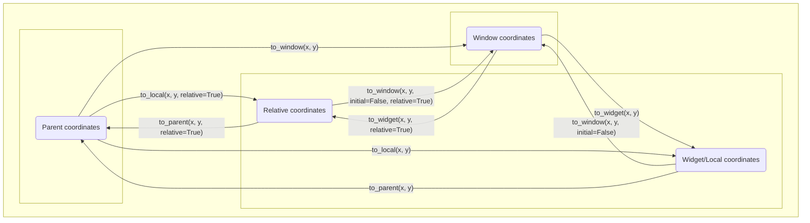

# Kivy notes
This README contains documentation about some odds and ends of Kivy but the official documentation does not describe in a satisfactory manner.

Chapters:
- [GridLayouts and size_hint](#kivy-gridlayout-and-size_hint)
- [Kivy Coordinates](#kivy-coordinates)


# Kivy GridLayout and size_hint
[Back to title](#kivy-notes)

By convention, Kivy zero-indexes the rows in a grid. So row 0 is the topmost row, row 1 is the second row from the top, and so on. Another important convention is that order in which widgets are added to the grid does not change what is considered row 0. For example, if the `orientation` attribute of the grid is set to `"rl-bt"`, then the grid fills the bottommost row first. But the topmost row is still considered row 0.

A GridLayout creates slots for all of its children and places each child widget in the bottom left corner of its slot. Typically, a widget is sized so it fills the entire area of its slot, but it is possible for a widget to take up less than the full area (we will discuss how later). In a somewhat similar fashion, it is usually not possible to make a widget take more space that what is available in its slot because the GridLayout will increase the size of the row/column containing the widget to ensure the slot and the widget have the same size. We will mention the exception to this rule later.

Every slot in a row will have the same height. Also, every slot in a column will have the same width. Therefore, we will use the height of a row and the height of a slot interchangeably in these notes.

There are three ways to set  the height of a row if the value of `row_force_default`, one of the properties available to a GridLayout, is `False` (its default value):
 - Make a widget have a `size_hint` of `(None, None)`. Then assign its `height` directly. If this height is larger than that of every other widget, the every slot in that row will have the height of that widget.
 - Assign the `row_default_height` of the GridLayout to some positive value. If this value is larger than the height of each widget in the row, then that row will have a height of `row_default_height`.
 - Assign a non-empty dictionary to the `rows_minimum` value of the GridLayout (`rows_minimum` is a `DictProperty`). If the row is the `n`th zero-indexed row, than map the number `n` to a number (in pixels) in the dictionary. If this number exceeds the height of the largest widget in the row, then the slot height for each widget in that row will be set the `rows_minimum[n]`.

What happens if you do all three of these? The maximum value prevails. So if you have

```
GridLayout:
    id: gridLayout
    row_default_height: 100
    rows_minimum: { 0: 200 }
    row_force_default: False  # redundant since this is the default value, but we include it for clarity
    cols: 1
    Button:
        text: "row 0"
    Button:
        text: "row 1"
    Button:
        size_hint: None, None
        size: 100, 300
        text: "row 2"
```

Then the slot for the button in row 0 will have a minimum height of 200, the slot for the button in row 1 will have a minimum height of 100, and the slot for button in row 2 will have a minimum height of 300.

The heights of rows 0 and 1 might actually be larger than 200 and 100, respectively, because the child widgets in each row have the default `size_hint` value of `(1, 1)`. This will only be the case if the height of the GridLayout exceeds that of the sum of each of its rows (600 in this case). We will go into detail soon about how `size_hint` affects the height later.

If the value of `row_force_default` is `True`, then the GridLayout will make the height of each slot in row `n` the value mapped by `n` in `rows_minimum` ictionary. If the key `n` is not in `rows_minimum`, then it will use the value of `row_default_height` for that row. If `row_force_default` is true, then  the `size_hint` or `size` of any child widgets has no influence on the height of the slots in any row.(Note that, by default, `rows_minimum` is an empty dictionary and `row_default_height` is `0`, so if you set `row_force_default` to `True` without assigning a value to `row_default_height` or `rows_minimum`, the GridLayout will have a `height` of `0` and not show up on the app at all!)

If the GridLayout height is smaller than the sum of the minimum heights of the rows, each row will still have its minimum height. The GridLayout respects the minimum height for each row religiously, even if this requires positioning widgets (or parts of widgets) outside of the Window.

Now to discuss how GridLayouts deal with `size_hint`. To do this, we will introduce the concept of allotted height. The allotted height for a GridLayout without any padding or spacing is calculated in the following way:
$$(\textnormal{GridLayout height}) - \sum(\textnormal{mininum height for each row})$$

Consider the example

```
GridLayout:
    id: gridLayout
    row_default_height: 100
    rows_minimum: { 0: 200 }
    row_force_default: False  # redundant since this is the default value, but we include it for clarity
    cols: 1
    Button:
        text: "row 0"
    Button:
        text: "row 1"
    Button:
        size_hint: None, None
        size: 100, 300
        text: "row 2"
```

As discussed before, row 0 has a minimum height of 200, row 1 has a minimum height of 100, and row 2 has a minimum height of 300. Then the allotted height for the widget with id `gridLayout` would be `gridLayout.height` - (200 + 100 + 300), or `gridLayout.height` - 600.

Now, suppose that `gridLayout` has a height less than or equal to its allotted height. Then `size_hint_y` adds NO additional height to any row with a non-`None` `size_hint_y`.

But suppose the GridLayout height exceeds the allotted height. Then sum the `size_hint_y` of every widget whose `size_hint_y` is not `None` (call this value "size_hint_y_sum"). Then a GridLayout then performs the following calculation for each child in the row:

$$\textnormal{child.size-hint-y}/\textnormal{size-hint-y-sum} \times \textnormal{allotted height} + (\textnormal{minimum height of the row containing child})$$

The largest value for each child in a particular row determines the height of the slot for each widget in that row.

Let us perform an example calculation using the previous example. Suppose that `gridLayout` has a `height` of 800. Now, it will go to row 0 which only has one widget. Note that, by default, a widget has a `size_hint` of `(1, 1)` meaning that its `size_hint_y` is `1`, and therefore the Button in row 0 and the Button in row 1 each have a `size_hint_y` of `1`. Then the "size_hint_y_sum" is 2. As discussed before, the allotted height for this row is 800 - 600 = 200. Therefore, `gridLayout` will perform the calculation

$$1 / 2 * 200 + 200 = 300$$

There are no other widgets in row 0, so the maximum value of this calculation for every widget in the 0th row is 300. Therefore the maximum slot height for every widget in row 0 is 300.

For row 1, it will determine that the slot height is 1 / 2 * 200 + 100 = 200.

The `size_hint_y` of the widget in row 2 is 0. Therefore, `gridLayout` does not award any fraction of the allotted height to row 2, and row 2 will have just its minimum height (300).

Feel free to run the following app and use the Kivy Inspector (ctrl + E) to verify that each row has the height that was described here.
```
from kivy.app import App
from kivy.core.window import Window
from kivy.lang import Builder
from kivy.modules import inspector


root_widget = Builder.load_string(f"""
# in TestApp.build(), we set the window height to 800.
# The GridLayout will, by default, fill the entire Window. So it's height will 
# be 800 unless you resize the Window after starting the app.
GridLayout:
    id: gridLayout
    row_default_height: 100
    rows_minimum: {{ 0: 200 }}
    row_force_default: False  # redundant since this is the default value, but we include it for clarity
    cols: 1
    Button:
        text: "row 0"
    Button:
        text: "row 1"
    Button:
        size_hint: None, None
        size: 100, 300
        text: "row 2"
""")


class TestApp(App):

    def build(self):
        Window.size = (800, 800)

        inspector.create_inspector(Window, root_widget)
        return root_widget


if __name__ == '__main__':
    TestApp().run()


```

Now, it is important to mention that the allotted height is different if there is padding or spacing assigned to the GridLayout. The most general formula for calculating allotted height for a row is

$$(\textnormal{gridLayout heigh}t) - (\textnormal{padding top}) - (\textnormal{padding bottom}) - (\textnormal{num of rows - 1}) * (\textnormal{vertical spacing}) - \sum(\textnormal{mininum height for each row})$$

You will notice from running this app that the button in row 2 does not fill its entire slot. This is because it has no `size_hint_x`. If you remove the `size_hint` property along any dimension for a child of a GridLayout and then assign a value to its `size`, you can cause the widget to not take up the full area of the slot.

If a child of a GridLayout has a non-`None` `size_hint_y`, it will ALWAYS fill the entire height of the slot. If a child has a non-`None` `size_hint_x`, it will ALWAYS fill the entire width of the slot.

If a widget has a non-`None` `size_hint_y`, then the GridLayout will ignore any assignments to that widget's `height` (this is default behavior for any Layout which listens to its children's `size_hint`). Unlike many other Layouts, the `size_hint` NEVER represents a % value of the `size` of the containing GridLayout. `size_hint`, for children of a GridLayout, is always fully analagous to the `flex-grow` rule in CSS (see the image below, courtesy of https://css-tricks.com/snippets/css/a-guide-to-flexbox/).


One final thing: if the `row_force_default` property of the gridLayout is set to `True`, the height of the `n`th slot is set to the value mapped by `n` in `rows_minimum`, unless `rows_minimum` does not contain `n` as a key, in which case the slot is set to `row_default_height`. However, this means that if you set the `size_hint` to (`None`, `None`) and then assign a size to the widget, you can make the widget have any `width` and `height` that you want. This is the only way to exceed the size of the slot for the widget.

To summarize:

Useful facts:
 - Rows are 0-indexed, so row 0 is the first row, row 1 is the second row, etc. No matter the orientation of the GridLayout (`tb-lr`, `bt-lr`, etc), the topmost row is row 0.
 - GridLayouts create slots for each of their child widgets. The slots have the same height for every row. Widgets are placed in the bottom left of each slot. 
 - If the widget has a value for `size_hint_y` that is not `None`, then it will take the full height of the slot. If the `size_hint_y` is `None`, then it is possible for the widget to take less than or more than the height of the slot.
 - GridLayouts calculate a minimum height for each of its rows. The GridLayout ensures that the height of the slots in each row is at least the minimum height, even if the sum of minimum heights exceeds the height of the GridLayout. The GridLayout will even draw its children outside of the Window if it has to.
 -  When keeping track of these behaviors, it is extremely useful to remember the following default values for properties of GridLayouts and widgets:
    - GridLayout:
      - `force_row_default`: `False`
      - `rows_minimum`: `{}`
      - `row_height_default`: 0
    - Widget:
      - `size_hint`: `(1, 1)`
        - And consequently, `size_hint_y`: `1`
      - `size`: `(100, 100)`
        - And consequently, `height`: `100`

The process:
 - If `force_row_default` set to `True`:
   - The the height of the slots for row `n` is determined by the keys in `rows_minimum`.
     - if `rows_minimum` contains the key `n`:
       - Then the height of the slots for row `n` is set to the value mapped by `n` in `rows_minimum`. 
     - If `rows_minimum` does not contain a key for `n`:
       - Then the height of the slots for row `n` is the value of `row_height_default`.
   - The slot height is now determined for every row. The children are then placed in the bottom left of each slot.
     - If the child has any non-`None` value for `size_hint_y`:
       - Then the child will fill the entire height of the slot.
     - If a child in row `n` has a `size_hint_y` set to `None`:
       - Then the GridLayout allows the user to determine the widget height. And value you assign to the `height` attribute becomes the height of the widget.
       - If `height` is less than the height of the slot, then the widget will not fill the entire vertical space of the slot.
       - If the `height` exceeds the height of the slot, then the widget will exceed the space of the slot.
   
 - If `force_row_default` is set to `False`:
   - The slot height for each row is the sum of the "minimum height" calculated for that row and a fraction of the "allotted height" for that row.
     - Minimum Height:
       - The GridLayout finds the largest of the following three values for the `n`th row and sets that value as the minimum height of that row.
         - If the key `n` exists in `rows_minimum`, then it uses the value mapped by `n`. If the key `n` is not in `rows_minimum`, then negative infinity.
         - If at least one child in the `n`th row has a `size_hint_y` set to `None`, then it uses the maximum height of every one of these children. If there are no children with a `size_hint_y` set to `None` in the `n`th row, then negative infinity.
         - The value of `row_height_default`.
     - Allotted Height:
       - The GridLayout determines the allotted height for each row by subtracting the following values from the height of the GridLayout:
         - The padding_top of the GridLayout (`padding[1]`)
         - The padding_bottom of the GridLayout (`padding[3]`)
         - The spacing between each row (`spacing[1]` * (number of rows - 1))
         - The sum of minimum heights for each row
       - If the allotted height is 0 or less than zero:
         - The slot height for every child in that row is just the minimum height and nothing more.
       - If the allotted height is greater than 0:
         - If every widget in the `n`th row has a `size_hint_y` with a value of `None`:
           - The slot height for every child in that row is just the minimum height and nothing more.
         - If at least one widget in row `n` has a non-`None` `size_hint_y`:
           - The GridLayout determines the maximum `size_hint_y` for every row which contains at least one child with a non-`None` `size_hint_y`.
           - The GridLayout sums of all maximum `size_hint_y`'s.
           - The GridLayout calculates the ratio of the maximum `size_hint_y` in row `n` to the sum of all maximum `size_hint_y`'s.
           - The GridLayout multiplies this ratio by the allotted height and adds that to the minimum height of row `n`.
    - The slot height is now determined for every row. The children are then placed in the bottom left of each slot.
      - If the child has a value of `size_hint_y` that is not `None`:
        - The child will take the full vertical space of the slot.
      - If a child has a `size_hint_y` whose value is `None`:
        - Then the GridLayout allows the user to determine the widget height. Any value you assign to the `height` attribute becomes the height of the widget.
        - Note that the `height` parameter will never exceed the height of the slot. If you review the process for how the slot height is calculated when `force_row_default` is `False`, you will see that the slot height for that row will increase to contain the widget if you try to increase the widget height beyond the slot height.
 
The behavior of widths and columns follows in the natural way. Just copy-paste what is written above, but replace every "row" with "column", every `row` with `col`, every "height" with "width", every "vertical" with "horizontal", and so on.

# Kivy Coordinates
[Back to title](#kivy-notes)

Subsections:
- [Defining the coordinate systems](#defining-the-coordinate-systems)
- [Consequences of the definitions](#consequences-of-the-definitions)
- [Coordinate transformation API](#coordinate-transformation-api)
- [Converting coordinates between widgets](#converting-coordinates-between-widgets)

### Defining the coordinate systems
[Back to chapter start](#kivy-coordinates)

[Back to title](#kivy-notes)

The `pos` attribute of a Kivy widget refers to the (`x`, `y`) position of the bottom-left corner of that widget. Typically, the origin of this coordinate system is the bottom-left corner of the containing window. 

Coordinates in this coordinate system are said to be in **window coordinates**. 

However, there are four “special” widgets which change the origin of the coordinate system for their children. These widgets are 

 - RelativeLayout 
 - ScrollView 
 - Scatter 
 - ScatterLayout 

To discuss this in detail, let us introduce the term “parent stack.” For example, if the root kv file of a Kivy application looked like the following: 

```kvlang
BoxLayout: 
    BoxLayout: 
        AnchorLayout: 
            BoxLayout: 
                Widget: 
```
 

Then `Widget`’s parent stack would be `BoxLayout`, `AnchorLayout`, `BoxLayout`, `BoxLayout`. `AnchorLayout`’s parent stack would be `BoxLayout`, `BoxLayout`. Note that the parent stack is ordered. 

Now, if the parent stack of a widget (let’s call it `widget_a`) includes one of the four special widgets, then `widget_a` adopts a new coordinate system. This new coordinate system has an origin located at the bottom-left corner of the first “special” widget in `widget_a`’s parent stack. 

Now we introduce the term **parent coordinates**. The parent coordinates of `widget_a` depend on whether `widget_a` has a special widget in its parent stack.  

 - If `widget_a` does not have a special widget in its parent stack: 
   - Then `widget_a`’s parent coordinates are equivalent to window coordinates. 
 - If `widget_a` has a special widget in its parent stack: 
   - Then the origin of the parent coordinates for `widget_a` is located at the bottom-left corner of the first special widget in `widget_a`’s parent stack. 

**It is crucial to understand that the pos attribute of a widget is in the parent coordinates of that widget.**

The Kivy docs do not mention this, but there is another coordinate system that they use. We will call it **relative coordinates**. The origin of the relative coordinates of `widget_a` is located at the bottom left of `widget_a`. 

Kivy uses one other coordinate system which is referred by two names: **widget coordinates / local coordinates**. The widget/local coordinates of `widget_a` are calculated in the following way: 

 - If `widget_a` is a special Widget: 
   - Then the widget/local coordinates for `widget_a` has the same origin as its relative coordinates.. 
 - If `widget_a` is not a special Widget: 
   - Then the widget/local coordinates for `widget_a` are equivalent to its parent coordinates. 

Window coordinates are an absolute coordinate system. The position (x, y) in window coordinates is the same point on the screen for every widget in a running application. However, parent coordinates, widget/local coordinates, and relative coordinates are always in reference to a particular widget. In other words, each widget has its own parent, widget/local, and relative coordinate system that may have a different origin from that of another widget. 

In summary:
 - **window coordinates**: The coordinate system whose origin is the bottom left of the application window. This coordinate system is the same for all widgets.
 - **parent coordinates**: Every widget has its own parent coordinates. If `widget_a` has one of the four "special" widgets (RelativeLayout, Scatter, ScatterLayout, ScrollView) in its parent stack, then the origin of the parent coordinates of `widget_a` is located at the bottom left of the first special widget in `widget_a`'s parent stack. If `widget_a` does not have any "special" widgets in its parent stack, then its parent coordinates have the same origin as the application's window coordinates. The `pos` attribute of a widget is in that widget's parent coordinates (as are the `x` and `y` attributes).
 - **relative coordinates**: Every widget has its own relative coordinates. The origin of `widget_a`'s relative coordinates is located at the bottom-left of `widget_a`.
 - **widget/local coordinates**: Every widget has its own widget/local coordinates. If `widget_a` is a "special" widget, then the origin of its widget/coordinates is the same as that of its relative coordinates. If `widget_a` is not a "special" widget, then the origin of its widget/local coordinates is the same as that of its parent coordinates.

### Consequences of the definitions
[Back to chapter start](#kivy-coordinates)

[Back to title](#kivy-notes)

- It is interesting to notice that, if there are no special widgets in the application, then window coordinates, widget/local coordinates, and parent coordinates for all widgets have the same origin. 
- It is also interesting to notice that the widget/local coordinates of the direct parent of `widget_a` are the same as the parent coordinates of `widget_a`. That is, given 

```kvlang
BoxLayout: 
    Widget: 
        id: widget_parent 
        Widget: 
            id: widget_a
```

the widget/local coordinate system of the widget with id `widget_parent` has the same origin as the parent coordinate system of `widget_a`. 
 - It is also interesting to notice that, if `widget_a` is a special widget, then its relative coordinates and widget/local coordinates are the same. 

 

### Coordinate transformation API
[Back to chapter start](#kivy-coordinates)

[Back to title](#kivy-notes)

Every widget has an API for converting positions to different coordinate systems. The methods are defined in the widget class and always take at least two arguments (`x` and `y`). The following image represents the API diagrammatically. A more precise description of the API will follow.



`to_local(x, y, relative=False)` 

 - If `relative` is set to `False` (the default value): 
   - `x`, `y` are assumed to be in the parent coordinates of the widget which calls the method. It returns a tuple that converts this position into widget/local coordinates of the widget which calls the method. 
 
For example, `widget_a.to_local(*widget_a.pos)` converts `widget_a`’s position into its local coordinates. (Remember that the pos attribute of a widget is always in that widget's parent coordinates). 

 - If `relative` is set to `True`: 
   - `x`, `y` are assumed to be in the parent coordinates of the widget which calls the method. Then the returned tuple will be in relative coordinates of the widget which calls the method. 

 

`to_parent(x, y, relative=False)` 

 - If `relative` is set to `False` (the default value): 
   - `x`, `y` are assumed to be in the local coordinates of the widget which calls the method. It returns a tuple that is this position in the parent coordinates of the widget which calls the method. 
 - If `relative` is set to `True`: 
   - `x`, `y` are assumed to be relative coordinates of the widget which calls the method. It returns a tuple that is this position in the parent coordinates of the widget which calls the method. 


`to_widget(x, y, relative=False)`
 - If `relative` is set to `False` (the default value):
   - `x`, `y` are assumed to be in window coordinates. It returns a tuple that is this position in the widget/local coordinates of the widget which calls the method. 
 - If `relative` is set to `True`:
   - `x`, `y` are assumed to be in window coordinates. It returns a tuple that is this position in the relative coordinates of the widget which calls the method. 

 
`to_window(x, y, initial=True, relative=False)`
 - If `initial` is set to `True` (the default value): 
   - `x`, `y` are assumed to be in parent coordinates of the widget which calls the method. It returns a tuple that is this position in window coordinates. 
 - If `initial` is set to `False`: 
   - If `relative` is set to `False` (the default value): 
     - `x`, `y` are assumed to be in widget/local coordinates of the widget which calls the method. It returns a tuple that is this position in window coordinates. 
   - If `relative` is set to `True`: 
     - `x`, `y` are assumed to be in the relative coordinates of the widget which calls the method. It returns a tuple that is this position in window coordinates. 
 - What are we to make of the case where `initial` is `True` and `relative` is `True`? 
   - If we inspect Kivy’s source code, `widget_a.to_window(x, y, initial=True, relative=True)` is equivalent to calling `widget_a.parent.to_window(x, y, relative=True)`. 
   - That is, `x`, `y` are assumed to be in the relative coordinates of the direct parent of the widget which calls the method. It returns a tuple that is this position in window coordinates. 
   - Never do this. If you ever need this very specific conversion, just use `widget_a.parent.to_window(x, y, relative=True)`, which is more declarative. 

### Converting coordinates between widgets
[Back to chapter start](#kivy-coordinates)

[Back to title](#kivy-notes)

It is a code smell if one widget directly accesses the position of another widget. For example, the following code attempts to place `widget_b` directly next to `widget_a`. 

```kvlang
Widget:
    RelativeLayout:
    	id: rl
        Widget: 
            id: a
    Widget:
        id: b
	# attempt to put b directly right of a
        pos: a.x + a.width, a.y 
```
 
However, the `pos` attribute (and the `x` and `y` attributes) of `a` and `b` are in different coordinate systems because `a` is in a `RelativeLayout` (one of the “special” widgets) while `b` is not. This may not place `b` in the expected location. 

It is safest to always use something like the following code snippet when one widget accesses the position of another widget. 

```python
from kivy.vector import Vector

def convert_pos(*args, input, output):  # noqa
    """
    Takes the pos attribute of input and returns a Vector representing
    that position in the parent coordinates of output.
    
    The function allows variable positional params. These do not affect 
    the behavior of this function, but they do allow one to easily 
    create bindings in kvlang.
    """
    window_coords = input.to_window(*input.pos)
	
    # widget/local coords of output's parent == output's parent coords
    output_parent_coords = output.parent.to_widget(*window_coords)
    
    # kivy Vectors are a subclass of Python lists.
    return Vector(output_parent_coords)
```
 
For example, `pos_in_b = convert_pos(input=a, output=b)` returns a Vector describing the position of `a` in the parent coordinates of `b` and sets the variable `pos_in_b` to a Vector representing this position. `pos_in_b[0]` or `pos_in_b.x` returns the x value of the converted coordinates and `pos_in_b[1]` or `pos_in_b.y` returns the y value of the converted coordinates.

The reason for introducing `*args` in the argument list is to allow the user to create the relavant bindings when using `convert_pos` in kvlang. For example,

```kvlang
#: import convert_pos utils.convert_pos

Widget:
    RelativeLayout:
    	id: rl
        Widget: 
            id: a
    Widget:
        id: b
	pos: convert_pos(a.pos, rl.pos, rl.size, input=a, output=b) + (a.width, 0)
	
	# if convert_pos were an ordinary list, not a kivy Vector, we would have to do
	# pos: convert_pos(a.pos, rl.pos, rl.size, input=a, output=b)[0] + a.width, convert_pos(a.pos, rl.pos, rl.size, input=a, output=b)[1]
	
	# or equivalently,
	# x: convert_pos(a.pos, rl.pos, rl.size, input=a, output=b)[0] + a.width
	# y: convert_pos(a.pos, rl.pos, rl.size, input=a, output=b)[1]
```

The window coordinates of the position of `a` will obviously change if `a.pos` changes, but it may also change if its "special" parent's position or size changes. Hence we create bindings to each of these properties.

We have chosen terse names for the ids of the widgets so that the lines don't stretch too long. However, it is good practice to use more declarative ids for your widgets. In such a case, it may be preferable to handle the binding logic directly in Python instead of kvlang. See the following example for a demonstration. First, create a project structure like the following:

```
my_project/
  main.py
  utils.py
```

Place the code snippet defining `convert_pos` in utils.py. Then in main.py,

```python
from kivy.app import App
from kivy.core.window import Window
from kivy.lang import Builder
from kivy.modules import inspector
from kivy.properties import ColorProperty
from kivy.properties import ObjectProperty
from kivy.uix.label import Label
from kivy.uix.relativelayout import RelativeLayout
from kivy.uix.scatter import Scatter
from kivy.uix.scatterlayout import ScatterLayout
from kivy.uix.scrollview import ScrollView

from utils import convert_pos


class ColoredBox(Label):
    bg_color = ColorProperty(None)


class ColoredBoxBindingsInPython(ColoredBox):
    widget_to_left = ObjectProperty(None)
    special_parent = ObjectProperty(None)

    def _update_pos(self, *args):
        widget_to_left = self.widget_to_left
        if widget_to_left is not None:
            left_pos = convert_pos(input=widget_to_left, output=self)
            self.pos = left_pos + (widget_to_left.width, 0)

    def on_widget_to_left(self, _instance, widget_to_left):

        def find_special_parent(event_dispatcher, *args):
            if event_dispatcher is Window:
                self.special_parent = Window
                return

            is_special = (
                    isinstance(event_dispatcher, RelativeLayout) or
                    isinstance(event_dispatcher, ScrollView) or
                    isinstance(event_dispatcher, Scatter) or
                    isinstance(event_dispatcher, ScatterLayout)
            )

            if is_special:
                self.special_parent = event_dispatcher
            else:
                find_special_parent(event_dispatcher.parent)

        find_special_parent(widget_to_left)

        if widget_to_left is not None:
            widget_to_left.bind(size=self._update_pos)
            widget_to_left.bind(pos=self._update_pos)

    def on_special_parent(self, _instance, special_parent):
        if special_parent is not None:
            special_parent.bind(size=self._update_pos)
            if special_parent is not Window:
                special_parent.bind(pos=self._update_pos)


root_widget = Builder.load_string(f"""
#: import convert_pos utils.convert_pos

#: set BLACK 0, 0, 0, 1
#: set WHITE 1, 1, 1, 1
#: set GREEN 0, 1, 0, 1
#: set BLUE 0, 0, 1, 1
#: set TRANSPARENT 0, 0, 0, 0

Widget:
    RelativeLayout:
        id: rl
        pos: 100, 100
        ColoredBox:
            id: a1
            bg_color: GREEN
            color: BLACK
            text: "incorrect"
        ColoredBox:
            id: a2
            pos: 200, 0
            bg_color: GREEN
            color: BLACK
            text: "correct"
        ColoredBox:
            id: green_box
            pos: 500, 0
            bg_color: GREEN
            color: BLACK
            text: "correct"
    ColoredBox:
        id: b1
        pos: a1.x + a1.width, a1.y
        bg_color: BLUE
        text: "incorrect"
    ColoredBox:
        id: b2
        pos: convert_pos(a2.pos, rl.pos, rl.size, input=a2, output=b2) + (a2.width, 0)
        bg_color: BLUE
        text: "correct"
    ColoredBoxBindingsInPython:
        widget_to_left: green_box
        bg_color: BLUE
        text: "correct"
    

<ColoredBox>:
    size_hint: None, None
    size: 100, 100
    canvas.before:
        Color:
            rgba: TRANSPARENT if self.bg_color is None else self.bg_color
        Rectangle:
            pos: self.pos
            size: self.size
""")


class TestApp(App):

    def build(self):
        inspector.create_inspector(Window, root_widget)
        return root_widget


if __name__ == '__main__':
    TestApp().run()

```
