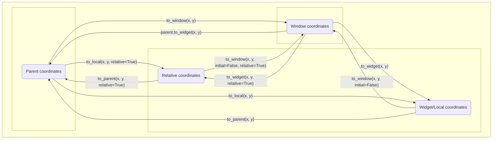

# Kivy notes
This README has two goals. The first is to provide documentation about odds and ends of Kivy but the official documentation does not describe in a satisfactory manner. The second is to describe tips and tricks that I have found useful in my own experience with Kivy. I hope this guide will prove to be useful to others.

Chapters:
- [The root widget is not the actual root](#the-root-widget-is-not-the-actual-root)
- [The bind trick](#the-bind-trick)
- [What size hint means](#what-size-hint-means)
- [Kivy Coordinates](#kivy-coordinates)
- [Converting coordinates between widgets](#converting-coordinates-between-widgets)
- [How Kivy finds resources](#how-kivy-finds-resources)

To be written:
 - `size_hint_min` and `size_hint_max`
 - The canvas tree
 - Things I wish I knew about canvases when I first started using Kivy
 - When to use RelativeLayouts (and why it's usually bad practice)
 - Sharing data between widgets
 - style.kv
 - RecycleView
 - How the event loop works

# The Root Widget is not the actual root
[Back to title](#kivy-notes)

Widgets are stored in the widget tree. The root of the widget tree is the widget returned by the `build` method of the Kivy app. For example, given:

```python
from kivy.app import App
from kivy.uix.button import Button


class TestApp(App):

    def build(self):
        return Button(text="Press me!")


if __name__ == '__main__':
    TestApp().run()
```

The `Button` instance will be the root widget. (It is also worth mentioning that the root widget can be determined from a kv file. See the first bullet point under [here](https://kivy.org/doc/stable-2.0.0/guide/lang.html#how-to-load-kv).)

Widgets have a `parent` attribute which points to that widget's parent. From what we know about trees, the root of the tree has no parent. So we would expect the root widget's `parent` attribute to be `None`. Let's test this. Try running the following code:

```python
from kivy.app import App
from kivy.uix.button import Button


class TestApp(App):

    def build(self):
        return Button(text="Press me!")

    def on_start(self):
        print(self.root.parent)  # the App instance has a "root" attribute which points to the root widget


if __name__ == '__main__':
    TestApp().run()
```

The result is surprising:


Evidently, the root widget has a parent, and it so happens to be the [global Window object](https://kivy.org/doc/stable/api-kivy.core.window.html). If you poke around the documentation for the `Window` object, you'll find that it has a method called `add_widget`. Wait a minute... can we add a second "root widget" to a running app?

Let's try it:

```python
from kivy.app import App
from kivy.core.window import Window
from kivy.uix.button import Button


class TestApp(App):

    def build(self):
        return Button(text="Press me!")

    def on_start(self):
        button2 = Button(text="button 2", size_hint=(0.1, 0.1))
        Window.add_widget(button2)


if __name__ == '__main__':
    TestApp().run()
```

The result:


Looks like the Window object can have multiple children. Well, it seems like the name "root widget" is a misnomer.

So, all of this begs the question: _why_ is Kivy architectured this way? The reason is that widgets added by the `Window` are always drawn above any widget contained in the tree starting from the root widget. Therefore, adding a widget to the `Window` guarantees that a widget is displayed on top of every other widget. The standard use case for this is when you want to render a popup window. In fact, the [ModalView](https://kivy.org/doc/stable-2.0.0/api-kivy.uix.popup.html) and [PopUp](https://kivy.org/doc/stable-2.0.0/api-kivy.uix.popup.html) widgets are implemented in this way.

The `Window` also has a `remove_widget` method that you can use to remove the widget from view.

Unlike the `add_widget` method available to the `Widget` class, `Window::add_widget` does not have an optional index argument, meaning that `Window` will always draw the most recently added Widget on top of everything else.

# The bind trick
[Back to title](#kivy-notes)

One of kvlang's conveniences is that it implicitly creates bindings whenever one Kivy property depends on others. Suppose we had a widget `CenteredLabel` that subclasses the Label widget. Also suppose that it renders its text context in the center of the widget, vertically and horizontally. We could then write

```kvlang
<CenteredLabel@Label>:
    size_hint: None, None
    text_size: self.size
    halign: "center"
    valign: "center"

FloatLayout:
    BoxLayout:
        Button:
            id: left_button
            active: False
            on_release:
                self.active = True
                right_button.active = False
        Button:
            id: right_button
            active: False
            on_release:
                self.active = True
                left_button.active = False
    CenteredLabel:
        id: centered_label
	# the following creates an implicit binding on left_button.active which will update centered_label.text whenever left_button.active changes 
        text: "left" if left_button.active else "right"
	# there are bindings on left_button.center, left_button.active, and right_button.center which will update centered_label.center
        center: left_button.pos if left_button.active else right_button.pos
	# there are bindings on left_button.size, left_button.active, and right_button.size
        size: left_button.size if left_button.active else right_button.size
```

This creates a widget with two buttons. Initially, there is not text displayed, but after a button has been pressed, text is displayed on whichever button has been pressed last. It is important to understand that, if the `active` attribute, `pos` attribute, or `size` attribute of left_button or right_button ever changes, then the CenteredLabel instance has its `text`, `center`, and `size` attributes automatically updated. kvlang creates these binding for you to save you time. In fact, kvlang will _always_ do this whenever for every Kivy property which appears in the expression assigned to another Kivy property in kvlang. 

Now suppose we tried to do this in Python. This would require something like

```python
class CenteredLabel(Label):
    pass

Builder.load_string(f"""
<CenteredLabel>:
    size_hint: None, None
    text_size: self.size
    halign: "center"
    valign: "center"
""")

float_layout = FloatLayout()
box_layout = BoxLayout()

class ActiveButton(Button):
    other_button = ObjectProperty(None)
    active = BooleanProperty(False)
    def on_release(self, *_args):
        self.active = True
        self.other_button.active = False

left_button = ActiveButton()
right_button = ActiveButton()

left_button.other_button = right_button
right_button.other_button = left_button

box_layout.add_widget(left_button)
box_layout.add_widget(right_button)
float_layout.add_widget(box_layout)

label = CenteredLabel()
float_layout.add_widget(label)

def update_label(*_args):
    if left_button.active:
        label.text = "left"
        label.size = left_button.size
        label.pos = left_button.pos
    elif right_button.active:
        label.text = "right"
        label.size = right_button.size
        label.pos = right_button.pos

# label must be updated whenever the positions, size, or active state of the buttons change
left_button.bind(active=update_label, pos=update_label, size=update_label)
right_button.bind(active=update_label, pos=update_label, size=update_label)
```

The advantage of creating this app with kvlang should be clear. Using pure Python is more verbose, makes the widget tree harder to picture, and forces us to explictly declare the binding logic.

As you can see, kvlang often makes your code easier to write and understand. However, sometimes the calculation for a widget property is quite complex and it doesn't make sense to try to express it in kvlang. An example of when this happened to me is when I had a widget which rendered multiple points on an image, and then each of these points was labeled. I used the following in kvlang to express this:

```kvlang
<Container>:
    ImageWithPoints:
        points: root.points  # the positions of the points is stored in the Container instance
    Label:
        text: "1"
        pos: root.get_nth_pos(1)  # my Container class has a method called get_nth_pos that contains a lot of calculation
    Label:
        text: "2"
        pos: root.get_nth_pos(2)
```

However, this wasn't quite right--what is the `points` attribute in Container changes? Then the points would shift, as should their labels. But there is no bindings here. The `pos` attributes are assigned the return value of `get_nth_pos` once and then never updated again.

I needed to add this binding logic to my code. I could have chosen to implement this purely in Python without kvlang to do this, but I didn't want to lose the clarity afforded to me by kvlang. A simple solution, I realized, was to add a keyword argument to `get_nth_pos`:

```python
class Container(BoxLayout):

    # this widget contained a lot of stuff that I am skipping over

    def get_nth_pos(self, n, *, bind):
        # involved calculation
```

Then I could do the following in kvlang:

```kvlang
<Container>:
    ImageWithPoints:
	id: image
        points: root.points  # the positions of the points is stored in the Container instance
    Label:
        text: "1"
        pos: root.get_nth_pos(1, bind=[root.points, image.pos, image.size])
    Label:
        text: "2"
        pos: root.get_nth_pos(2, bind=[root.points, image.pos, image.size])
```

Now, the `pos` attributes of the Label instances are recalculated whenever `root.points`, `image.pos`, or `image.size` changes. Funnily enough, these attributes weren't used in the calculation at all, but their appearance in kvlang caused the bindings to apply.

This trick, which I call the "bind pattern" or the "bind trick", gives you the best of both worlds. You get binding boilderplate written for you while also keeping complicated logic away from kvlang. It also has effect of taking what is normally _implicit_ binding logic and making it _explicit_, without sacrificing the concision kvlang's automatic bindings provide. This pattern is quite helpful and has saved me a lot of time. Note that it is important to document the role of the `bind` keyword in a docstring under the Python method or you may greatly confuse your coworker when they see a keyword argument that seems to do nothing.

The only thing that annoys me about this trick is that my IDE always complains to me that I'm declaring a keyword argument that isn't used in the method. I've wondered if its possible to create a decorator so I can do something like

```python
    @kvbind
    get_nth_pos(n)
```

and then the method automatically gets a `bind` keyword tacked on the end without annoying my IDE. If such a thing is possible I would like to start doing things that way.

# What size hint means
[Back to title](#kivy-notes)

Subsections:
- [FloatLayout and similar widgets](#floatlayout-and-similar-widgets)
- [AnchorLayouts](#anchorlayout-and-size-hint)
- [BoxLayouts](#boxlayout-and-size-hint)
- [StackLayouts](#stacklayout-and-size-hint)
- [GridLayouts](#stacklayout-and-size-hint)

Not every Layout listens to the `size_hint` attribute of its children. But for those that do, there are two general approaches to how they interpret the `size_hint` property.

The first is that the `size_hint_x` represents a percent width of the containing Layout, and `size_hint_y` represents a percent height of the containing Layout. We will refer to any Layout which interprets `size_hint` in this way as "**percent-like**".

The second approach is very similar to how CSS treats the "flex-grow" property. I can't explain this better than how the [following image](https://css-tricks.com/snippets/css/a-guide-to-flexbox/#aa-flex-grow) describes it:


We will refer to any Layout which interprets `size_hint` in this way as "**flex-grow-like**".

Another useful concept is **allotted width** and **allotted height**. Some Layouts will subtract a fixed number of pixels from the width and height to create an allotted width and allotted height, and then divies up this remaining space amongst its children. For example:

 - If an AnchorLayout has left padding and right padding, it will subtract that from its total width when determining its allotted width
 - If a BoxLayout has three children and its vertical spacing is 10 pixels, it will subtract 20 pixels from either its allotted height
 - If a BoxLayout has a child with a `size_hint_x` of `None` and a `width` of 100, then the Layout will subract 100 pixels from its allotted width  

We will now go into more specific detail about the Layouts which listen to `size_hint`, with one exception: I will not describe how the `size_hint_mix_x` and `size_hint_max_y` and other similar attributes affect things. If I get around to it, I will describe the effects of those in another chapter.

### FloatLayout and similar widgets
[Back to chapter start](#what-size-hint-means)

[Back to title](#kivy-notes)

There are three "widgets" which behave like FloatLayout:

 - FloatLayout
 - RelativeLayout
 - Window

The global `Window` object is technically not a widget. However, the root widget of the application's `parent` attribute points to the `Window` object, and the `Window` object actually manages the size of the root widget. `Window` can, unintuitively, also have multiple widgets as children and manage all of their sizes. So it is fair in this context to treat it like a widget.

These Layouts listen are all percent-like in the most straighforward way. `size_hint_x` represents a percentage of the width of the containing Layout and `size_hint_y` represents a percentage of the height of the containing Layout. That's it.

### AnchorLayout and size hint
[Back to chapter start](#what-size-hint-means)

[Back to title](#kivy-notes)

AnchorLayout is also percent-like, but it also calculates an allotted width and allotted height, and the `size_hint_x` is a percentage of the AnchorLayout's allotted width, not its total width.

An AnchorLayout's allotted width is its total width minus the sum of its left and right padding, while the allotted height is its total height minus the top and bottom padding. The `padding` attribute is a list with four elements which determines the left, top, right, and bottom padding values in that order.

### BoxLayout and size hint
[Back to chapter start](#what-size-hint-means)

[Back to title](#kivy-notes)

BoxLayout is an interesting case, as it is percent-like and flex-grow-like at the same time. The behavior also depends on its `orientation` attribute (which is either `"horizontal"` or `"vertical"`).

- If `orientation` is `"horizontal"`:
  - `size_hint_x` is flex-grow-like.
    - The BoxLayout also calculates an allotted width by subtracting the following values from the total width:
      - The left and right padding
      - The value of the `spacing` attribute multiplied by (1 - (number of children))
      - The sum of `width`s of all children whose `size_hint_x` are `None` 
  - `size_hint_y` is percent-like.
    - The BoxLayout calculates an allotted height by subtracting the top and bottom padding from the its total height.
- If `orientation` is `"vertical"`:
  - `size_hint_x` is percent-like.
    - The BoxLayout calculates an allotted width by subtracting the left and right padding from its total width.
  - `size_hint_y` is flex-grow-like
    - The BoxLayout also calculates the allotted height by subtracting the following values from the total height:
      - The top and bottom padding
      - The value of the `spacing` attribute multiplied by (1 - (number of children))
      - The sum of `height`s of all children whose `size_hint_y` are `None` 

### StackLayout and size hint
[Back to chapter start](#what-size-hint-means)

[Back to title](#kivy-notes)

For StackLayouts, `size_hint` is percent-like. StackLayouts also calculate allotted widths and allotted heights. However, how the allotted width/height is calculated depends on the `orientation` of the StackLayout, which can be one of the strings `tb-lr`, `tb-rl`, `bt-lr`, `bt-rl`, `lr-tb`, `lr-bt`, `rl-tb`, `rl-bt`.

- If `orientation` starts with `"tb"` or `"bt"`:
  - Allotted width:
    - The allotted width is the same for each column.
    - Unintuitively, the StackLayout does not use the horizontal spacing value (`spacing[0]`) when calculating the allotted width.
    - The allotted width is simply total width of the Stacklayout minus the left and right padding.
    - The allotted width is not changed if one child has a fixed width (i.e., its `size_hint_x` is `None`)
  - Allotted height:
    - The allotted height can be different for each column.
    - The allotted height for the nth column in the total height minus:
      - The number of children in that column minus 1, multiplied by the vertical spacing value (`spacing[1]`)
      - The top and bottom padding
    - The allotted height is not changed if one child has a fixed height (i.e., its `size_hint_y` is `None`)
- If `orientation` starts with `"rl"` or `"lr"`:
  - Allotted width:
    - The allotted width can be different for each column.
    - The allotted width for the nth row is the total width minus:
      - The number of children in that row minus 1, multiplied by the horizontal spacing value (`spacing[0]`)
      - The top and bottom padding
    - The allotted width is not changed if one child has a fixed width (i.e., its `size_hint_x` is `None`)
  - Allotted height:
    - The allotted height is the same for each column.
    - Unintuitively, the StackLayout does not use the vertical spacing value (`spacing[1]`) when calculating the allotted height.
    - The allotted height is simply total height of the Stacklayout minus the top and bottom padding.
    - The allotted height is not changed if one child has a fixed height (i.e., its `size_hint_y` is `None`)

### GridLayouts and size hint
[Back to chapter start](#what-size-hint-means)

[Back to title](#kivy-notes)

GridLayouts are by far the most complex Layout in regards to how they listen to `size_hint`. Most of the time, GridLayouts are flex-grow-like but there are a lot of edge cases and nuances. Since there is so much to cover, so we will first go over some useful facts regarding GridLayouts.

Useful facts:
 - Rows are 0-indexed, so row 0 is the first row, row 1 is the second row, etc. No matter the orientation of the GridLayout (`tb-lr`, `bt-lr`, etc), the **topmost** row is row 0.
 - Columns are also 0-indexed. No matter the orientation of the GridLayout, the **leftmost** column is column 0.
 - GridLayouts create slots for each of their child widgets. The slots have the same height for every row and have the same width for every column. Widgets are placed in the bottom left of each slot. 
 - If the widget has a value for `size_hint_y` that is not `None`, then it will take the full height of the slot. If the `size_hint_y` is `None`, then it is possible for the widget to take less than or more than the height of the slot. A similar rule is followed for `size_hint_x`.
   - (There are expections to this if the child has values for `size_hint_y_min` or other similar attributes. But we'll discuss those another time). 
 - GridLayouts calculate a minimum height for each of its rows. The GridLayout ensures that the height of the slots in each row is at least the minimum height, even if the sum of minimum heights exceeds the height of the GridLayout. The GridLayout will even draw its children outside of the Window if it has to.
 -  When keeping track of these behaviors, it is extremely useful to remember the following default values for properties of GridLayouts and widgets:
    - GridLayout:
      - `force_row_default`: `False`
      - `rows_minimum`: `{}`
      - `row_height_default`: 0
    - Widget:
      - `size_hint`: `(1, 1)`
        - And consequently, `size_hint_y`: `1`
      - `size`: `(100, 100)`
        - And consequently, `height`: `100`

We will now describe the process for how `size_hint_y` is calculated. The behavior of `size_hint_x` follows in the natural way. Just copy-paste what is written below, but replace every "row" with "column", every `row` with `col`, every "height" with "width", every "vertical" with "horizontal", and so on.

The process:
 - If `cols` is `None` and `rows` is `None`:
   - The GridLayout does not manage the positions and sizes of its children. The `size_hint` attribute of any child of the GridLayout has no effect. 
 - If `force_row_default` set to `True`:
   - The the height of the slots for row `n` is determined by the keys in `rows_minimum`.
     - if `rows_minimum` contains the key `n`:
       - Then the height of the slots for row `n` is set to the value mapped by `n` in `rows_minimum`. 
     - If `rows_minimum` does not contain a key for `n`:
       - Then the height of the slots for row `n` is the value of `row_height_default`.
   - The slot height is now determined for every row. The children are then placed in the bottom left of each slot.
     - If the child has any non-`None` value for `size_hint_y`:
       - Then the child will fill the entire height of the slot.
     - If a child in row `n` has a `size_hint_y` set to `None`:
       - Then the GridLayout allows the user to determine the widget height. And value you assign to the `height` attribute becomes the height of the widget.
       - If `height` is less than the height of the slot, then the widget will not fill the entire vertical space of the slot.
       - If the `height` exceeds the height of the slot, then the widget will exceed the space of the slot.
   
 - If `force_row_default` is set to `False`:
   - The slot height for each row is the sum of the "minimum height" calculated for that row and a fraction of the "allotted height" of the GridLayout.
     - Minimum Height:
       - The GridLayout finds the largest of the following three values for the `n`th row and sets that value as the minimum height of that row.
         - If the key `n` exists in `rows_minimum`, then it uses the value mapped by `n`. If the key `n` is not in `rows_minimum`, then negative infinity.
         - If at least one child in the `n`th row has a `size_hint_y` set to `None`, then it uses the maximum height of every one of these children. If there are no children with a `size_hint_y` set to `None` in the `n`th row, then negative infinity.
         - The value of `row_height_default`.
     - Allotted Height:
       - The GridLayout determines the allotted height for each row by subtracting the following values from the height of the GridLayout:
         - The padding_top of the GridLayout (`padding[1]`)
         - The padding_bottom of the GridLayout (`padding[3]`)
         - The spacing between each row (`spacing[1]` * (number of rows - 1))
         - The sum of minimum heights for each row
       - If the allotted height is 0 or less than zero:
         - The slot height for every child in that row is just the minimum height and nothing more.
       - If the allotted height is greater than 0:
         - If every widget in the `n`th row has a `size_hint_y` with a value of `None`:
           - The slot height for every child in that row is just the minimum height and nothing more.
         - If at least one widget in row `n` has a non-`None` `size_hint_y`:
           - The GridLayout determines the maximum `size_hint_y` for every row which contains at least one child with a non-`None` `size_hint_y`.
           - The GridLayout sums of all maximum `size_hint_y`'s.
           - The GridLayout calculates the ratio of the maximum `size_hint_y` in row `n` to the sum of all maximum `size_hint_y`'s.
           - The GridLayout multiplies this ratio by the allotted height and adds that to the minimum height of row `n`.
    - The slot height is now determined for every row. The children are then placed in the bottom left of each slot.
      - If the child has a value of `size_hint_y` that is not `None`:
        - The child will take the full vertical space of the slot.
      - If a child has a `size_hint_y` whose value is `None`:
        - Then the GridLayout allows the user to determine the widget height. Any value you assign to the `height` attribute becomes the height of the widget.
        - Note that the `height` parameter will never exceed the height of the slot. If you review the process for how the slot height is calculated when `force_row_default` is `False`, you will see that the slot height for that row will increase to contain the widget if you try to increase the widget height beyond the slot height.

# Kivy Coordinates
[Back to title](#kivy-notes)

Subsections:
- [Defining the coordinate systems](#defining-the-coordinate-systems)
- [Coordinate transformation API](#coordinate-transformation-api)

### Defining the coordinate systems
[Back to chapter start](#kivy-coordinates)

[Back to title](#kivy-notes)

The `pos` attribute of a Kivy widget refers to the (`x`, `y`) position of the bottom-left corner of that widget. Typically, the origin of this coordinate system is the bottom-left corner of the containing window. Coordinates in this coordinate system are said to be in **window coordinates**. 

However, there are four “special” widgets which change the origin of the coordinate system for their children. These widgets are 

 - RelativeLayout 
 - ScrollView 
 - Scatter 
 - ScatterLayout 

To discuss this in detail, let us introduce the term “parent stack.” For example, if the root kv file of a Kivy application looked like the following: 

```kvlang
BoxLayout: 
    BoxLayout: 
        AnchorLayout: 
            BoxLayout: 
                Widget: 
```
 

Then `Widget`’s parent stack would be `BoxLayout`, `AnchorLayout`, `BoxLayout`, `BoxLayout`. `AnchorLayout`’s parent stack would be `BoxLayout`, `BoxLayout`. Note that the parent stack is ordered. 

Now, if the parent stack of a widget (let’s call it `widget_a`) includes one of the four special widgets, then `widget_a` adopts a new coordinate system. This new coordinate system has an origin located at the bottom-left corner of the first “special” widget in `widget_a`’s parent stack. 

Now we introduce the term **parent coordinates**. The parent coordinates of `widget_a` depend on whether `widget_a` has a special widget in its parent stack.  

 - If `widget_a` does not have a special widget in its parent stack: 
   - Then `widget_a`’s parent coordinates are equivalent to window coordinates. 
 - If `widget_a` has a special widget in its parent stack: 
   - Then the origin of the parent coordinates for `widget_a` is located at the bottom-left corner of the first special widget in `widget_a`’s parent stack. 

**It is crucial to understand that the pos attribute of a widget is in the parent coordinates of that widget.**

The Kivy docs do not mention this, but there is another coordinate system that they use. We will call it **relative coordinates**. The origin of the relative coordinates of `widget_a` is located at the bottom left of `widget_a`. 

Kivy uses one other coordinate system which is referred by two names: **widget coordinates / local coordinates**. The widget/local coordinates of `widget_a` are the parent coordinates of the immediate children of `widget_a` (when we say "immediate children", we are excluding its grandchildren, great-grandchildren, and so on). Most of the time, a widget's widget/local coordinate system is the same as its parent coordinate system. But if a widget is a "special" widget, then its widget/local coordinate system is the same as its relative coordinate system.

Window coordinates are an absolute coordinate system. The position (x, y) in window coordinates is the same point on the screen for every widget in a running application. However, parent coordinates, widget/local coordinates, and relative coordinates are always in reference to a particular widget. In other words, each widget has its own parent, widget/local, and relative coordinate system that may have a different origin from that of another widget. 

In summary:
 - **window coordinates**: The coordinate system whose origin is the bottom left of the application window. This coordinate system is the same for all widgets.
 - **parent coordinates**: Every widget has its own parent coordinates. If `widget_a` has one of the four "special" widgets (RelativeLayout, Scatter, ScatterLayout, ScrollView) in its parent stack, then the origin of the parent coordinates of `widget_a` is located at the bottom left of the first special widget in `widget_a`'s parent stack. If `widget_a` does not have any "special" widgets in its parent stack, then its parent coordinates have the same origin as the application's window coordinates. The `pos` attribute of a widget is in that widget's parent coordinates (as are the `x` and `y` attributes).
 - **relative coordinates**: Every widget has its own relative coordinates. The origin of `widget_a`'s relative coordinates is located at the bottom-left of `widget_a`.
 - **widget/local coordinates**: Every widget has its own widget/local coordinates. The widget/local coordinates of `widget_a` are the parent coordinates of the immediate children of `widget_a`. This means that if `widget_a` is a "special" widget, then the origin of its widget/coordinates is the same as that of its relative coordinates. If `widget_a` is not a "special" widget, then the origin of its widget/local coordinates is the same as its parent coordinates.

### Coordinate transformation API
[Back to chapter start](#kivy-coordinates)

[Back to title](#kivy-notes)

Every widget has an API for converting positions to different coordinate systems. The methods are defined in the widget class and always take at least two arguments (`x` and `y`). The following image represents the API diagrammatically. A more precise description of the API will follow.



`to_local(x, y, relative=False)` 

 - If `relative` is set to `False` (the default value): 
   - `x`, `y` are assumed to be in the parent coordinates of the widget which calls the method. It returns a tuple that converts this position into widget/local coordinates of the widget which calls the method. 
 
For example, `widget_a.to_local(*widget_a.pos)` converts `widget_a`’s position into its local coordinates. (Remember that the pos attribute of a widget is always in that widget's parent coordinates). 

 - If `relative` is set to `True`: 
   - `x`, `y` are assumed to be in the parent coordinates of the widget which calls the method. Then the returned tuple will be in relative coordinates of the widget which calls the method. 

 

`to_parent(x, y, relative=False)` 

 - If `relative` is set to `False` (the default value): 
   - `x`, `y` are assumed to be in the local coordinates of the widget which calls the method. It returns a tuple that is this position in the parent coordinates of the widget which calls the method. 
 - If `relative` is set to `True`: 
   - `x`, `y` are assumed to be relative coordinates of the widget which calls the method. It returns a tuple that is this position in the parent coordinates of the widget which calls the method. 


`to_widget(x, y, relative=False)`
 - If `relative` is set to `False` (the default value):
   - `x`, `y` are assumed to be in window coordinates. It returns a tuple that is this position in the widget/local coordinates of the widget which calls the method. 
 - If `relative` is set to `True`:
   - `x`, `y` are assumed to be in window coordinates. It returns a tuple that is this position in the relative coordinates of the widget which calls the method.


`to_window(x, y, initial=True, relative=False)`
 - If `initial` is set to `True` (the default value): 
   - `x`, `y` are assumed to be in parent coordinates of the widget which calls the method. It returns a tuple that is this position in window coordinates. 
 - If `initial` is set to `False`: 
   - If `relative` is set to `False` (the default value): 
     - `x`, `y` are assumed to be in widget/local coordinates of the widget which calls the method. It returns a tuple that is this position in window coordinates. 
   - If `relative` is set to `True`: 
     - `x`, `y` are assumed to be in the relative coordinates of the widget which calls the method. It returns a tuple that is this position in window coordinates. 
 - What are we to make of the case where `initial` is `True` and `relative` is `True`? 
   - If we inspect Kivy’s source code, `widget_a.to_window(x, y, initial=True, relative=True)` is equivalent to calling `widget_a.parent.to_window(x, y, initial=False, relative=True)`. 
   - That is, `x`, `y` are assumed to be in the relative coordinates of the direct parent of the widget which calls the method. It returns a tuple that is this position in window coordinates. 
   - Never do this. If you ever need this very specific conversion, just use `widget_a.parent.to_window(x, y, initial=False, relative=True)`, which is more declarative.


`parent.to_widget(x, y)`
 - `x`, `y` are assumed to be in window coordinates. It returns a tuple that converts this position into the parent coordinates of the widget which calls the method.
   - For example, `widget_a.pos = widget_a.parent.to_widget(Window.width/2, Window.height/2)` places the bottom-left corner of `widget_a` in the center of the application.
   - This hack works because, as mentioned in [the previous chapter](#consequences-of-the-definitions), the widget/local coordinates of a parent has the same origin as the parent coordinates of its child.


# Converting coordinates between widgets
[Back to title](#kivy-notes)

It is a code smell if one widget directly accesses the position of another widget. For example, the following code attempts to place `widget_b` directly next to `widget_a`. 

```kvlang
Widget:
    RelativeLayout:
    	id: rl
        Widget: 
            id: a
    Widget:
        id: b
	# attempt to put b directly right of a
        pos: a.x + a.width, a.y 
```
 
However, the `pos` attribute (and the `x` and `y` attributes) of `a` and `b` are in different coordinate systems because `a` is in a `RelativeLayout` (one of the “special” widgets) while `b` is not. This may not place `b` in the expected location. 

You might then ask how one widget may safely access the position of the widget. But before doing this in an actual application, please consult the following checklist.

- Do you really need to access the position of another widget directly? With a proper widget tree, this is rarely ever necessary.
- Double check that you really must access the widget's position directly.
- Triple-check that you really must access the widget's position directly.

If you are confident that you must do this, then read on. However, there are lots of subtleties required to do this robustly.

You'd *think* that the answer is simple. Just convert the other widget's coordinates into window coordinates, and then convert those window coordinates into the parent coordinates of the current widget. For example,

```python
widget_a = Widget()
widget_b = Widget()

# do stuff and place widget_a and widget_b in the widget tree

a_pos_in_window_coords = widget_a.to_window(*widget_a.pos)
a_pos_in_parent_coords_of_b = widget_b.parent.to_widget(*window_coords)

widget_b.pos = b_parent_coords  # naive!
```

However, if `widget_a` changes its position, then `widget_b` should also move. So we might then try

```python
widget_a = Widget()
widget_b = Widget()

# do stuff and place widget_a and widget_b in the widget tree

def update_b_pos(*args):
    a_pos_in_window_coords = widget_a.to_window(*widget_a.pos)
    a_pos_in_parent_coords_of_b = widget_b.parent.to_widget(*window_coords)
    widget_b.pos = b_parent_coords 

widget_a.bind(pos=update_b_pos, size=update_b_pos)  # naive!
```

However, it is possible for `widget_a` to change its position in window coordinates without changing its `pos` or `size` attributes. For example, if `widget_a` is a child of a `RelativeLayout` then it will change its position in window coordinates whenever the position of the `RelativeLayout` changes. This can even happen if the size of the RelativeLayout changes (for example, suppose the RelativeLayout is anchored to the right of some boundary and then `widget_a`'s `pos` attribute is `0, 0`). 

So the correct strategy for placing `widget_b` directly on top of `widget_a` is as follows:
 - initialize our two widgets `widget_a` and `widget_b`
 - place them in the widget tree
 - find the "special" parent of `widget_a`, if it has one
 - create a method which converts `widget_a`'s position into the parent coordinates of `widget_b` and then assigns `widget_b.pos` to that value
 - bind this method to changes in `widget_a`'s pos, size, as well as to changes to the pos and size of the special parent of `widget_a`

For example,

```python
from kivy.core.window import Window

widget_a = Widget()
widget_b = Widget()

# do stuff and place widget_a and widget_b in the widget tree

# find widget_a's special parent
def find_special_parent_of(event_dispatcher, initial=True):
    # start crawling widget tree, starting at widget's parent
    if initial:
        find_special_parent_of(event_dispatcher.parent, initial=False)
    
    # base case
    if (
    event_dispatcher is Window or
    isinstance(event_dispatcher, RelativeLayout) or
    isinstance(event_dispatcher, ScrollView) or
    isinstance(event_dispatcher, Scatter) or
    isinstance(event_dispatcher, ScatterLayout)):
        return event_dispatcher

    find_special_parent_of(event_dispatcher.parent, initial=False)

special_parent = find_special_parent_of(widget_a)

def update_b_pos(*args):
    a_pos_in_window_coords = widget_a.to_window(*widget_a.pos)
    a_pos_in_parent_coords_of_b = widget_b.parent.to_widget(*window_coords)
    widget_b.pos = b_parent_coords

widget_a.bind(pos=update_b_pos, size=update_b_pos)
special_parent.bind(size=update_b_pos)

if special_parent is not Window:
    special_parent.bind(pos=update_b_pos)
```

What if we want to assign positions directly in kvlang? To start, it will be helpful to create the following utility function:

```python
def convert_pos(*, input, output):
    window_coords = input.to_window(*input.pos)
    output_parent_coords = output.parent.to_widget(*window_coords)
    
    return output_parent_coords
```

For example, `pos_in_b = convert_pos(input=a, output=b)` returns a list such that `pos_in_b[0]` returns the x value of the converted coordinates and `pos_in_b.[1]` returns the y value of the converted coordinates. However, I will also suggest making the following simple change:

```python
from kivy.vector import Vector

def convert_pos(*, input, output):
    window_coords = input.to_window(*input.pos)
    output_parent_coords = output.parent.to_widget(*window_coords)
    
    # kivy Vectors are a subclass of Python lists.
    return Vector(output_parent_coords)
```

With this change, then `pos_in_b = convert_pos(input=a, output=b)` returns a Vector describing the position of `a` in the parent coordinates of `b` and sets the variable `pos_in_b` to a Vector representing this position. `pos_in_b[0]` or `pos_in_b.x` returns the x value of the converted coordinates and `pos_in_b[1]` or `pos_in_b.y` returns the y value of the converted coordinates.

Kivy Vectors are a subclass of Python lists. Therefore, you can treat the return value of `convert_pos` as a list if you want. However, by making it a Vector, we add additional conveniences that an experienced user can choose to take advantage of if they want.

Let's make one more adjustment to the method. We will use the [bind trick](#bind-trick) since we are abstracting logic away from kvlang. We'll also include a docstring:

```python
from kivy.vector import Vector

def convert_pos(*, input, output, bind=None):
    """
    Takes the pos attribute of input and returns a Vector representing
    that position in the parent coordinates of output.
    
    The bind keyword does not affect the behavior of this function but 
    instead allows one to declaratively create bindings in kvlang.
    """
    window_coords = input.to_window(*input.pos)
    output_parent_coords = output.parent.to_widget(*window_coords)
    
    return Vector(output_parent_coords)
```

This is the final version of the method. Now, let's see it in action. 

The following code places one widget directly to the right of another:

```kvlang
#: import convert_pos utils.convert_pos

Widget:
    RelativeLayout:
    	id: rl
        Widget: 
            id: a
    Widget:
        id: b
	pos: convert_pos(input=a, output=b, bind=[a.pos, a.size, rl.pos, rl.size]) + (a.width, 0)
	
	# if convert_pos were an ordinary list, not a kivy Vector, we would have to do
	# pos: convert_pos(input=a, output=b, bind=[a.pos, a.size, rl.pos, rl.size])[0] + a.width, convert_pos(input=a, output=b, bind=[a.pos, a.size, rl.pos, rl.size])[1]
	
	# or equivalently,
	# x: convert_pos(input=a, output=b, bind=[a.pos, a.size, rl.pos, rl.size])[0] + a.width
	# y: convert_pos(input=a, output=b, bind=[a.pos, a.size, rl.pos, rl.size])[1]
```

All of this is pretty involved, isn't it? That's why you should always triple-check whether you ought to do this in the first place.

To conclude, we will show a replicable example that will show both approaches for accessing the position of anyother widget. To do so, create the project structure

```
my_project/
  main.py
  utils.py
```

Place the code snippet defining `convert_pos` in utils.py. Then in main.py,

```python
from kivy.app import App
from kivy.core.window import Window
from kivy.lang import Builder
from kivy.modules import inspector
from kivy.properties import ColorProperty
from kivy.properties import ObjectProperty
from kivy.uix.label import Label
from kivy.uix.relativelayout import RelativeLayout
from kivy.uix.scatter import Scatter
from kivy.uix.scatterlayout import ScatterLayout
from kivy.uix.scrollview import ScrollView

from utils import convert_pos


class ColoredBox(Label):
    bg_color = ColorProperty(None)


class ColoredBoxBindingsInPython(ColoredBox):
    """This widget sets it pos property so that is placed directly to the right of self.widget_to_left."""
    widget_to_left = ObjectProperty(None)
    special_parent = ObjectProperty(None)

    def _update_pos(self, *args):
        widget_to_left = self.widget_to_left
        if widget_to_left is not None:
            left_pos = convert_pos(input=widget_to_left, output=self)
            self.pos = left_pos + (widget_to_left.width, 0)

    def _find_special_parent(self, event_dispatcher, initial=True):
        """Recursively crawls up the widget tree to find the first special parent of the given event dispatcher."""
        if initial:
            self._find_special_parent(event_dispatcher.parent, initial=False)

        if event_dispatcher is Window:
            self._find_special_parent = Window
            return

        is_special = (
                isinstance(event_dispatcher, RelativeLayout) or
                isinstance(event_dispatcher, ScrollView) or
                isinstance(event_dispatcher, Scatter) or
                isinstance(event_dispatcher, ScatterLayout))

        if is_special:
            self.special_parent = event_dispatcher
        else:
            self._find_special_parent(event_dispatcher.parent, initial=False)

    def on_widget_to_left(self, _instance, widget_to_left):
        """Creates the appropriate bindings to widget_to_left. Also finds the special parent of widget_to_left."""
        self._find_special_parent(widget_to_left)

        if widget_to_left is not None:
            widget_to_left.bind(size=self._update_pos)
            widget_to_left.bind(pos=self._update_pos)

    def on_special_parent(self, _instance, special_parent):
        """Creates the appropriate bindings to the special parent of widget_to_left."""
        if special_parent is not None:
            special_parent.bind(size=self._update_pos)
            if special_parent is not Window:
                special_parent.bind(pos=self._update_pos)


root_widget = Builder.load_string(f"""
#: import convert_pos utils.convert_pos

#: set BLACK 0, 0, 0, 1
#: set WHITE 1, 1, 1, 1
#: set GREEN 0, 1, 0, 1
#: set BLUE 0, 0, 1, 1
#: set TRANSPARENT 0, 0, 0, 0

Widget:
    RelativeLayout:
        id: rl
        pos: 100, 100
        ColoredBox:
            id: a1
            bg_color: GREEN
            color: BLACK
            text: "incorrect"
        ColoredBox:
            id: a2
            pos: 200, 0
            bg_color: GREEN
            color: BLACK
            text: "correct"
        ColoredBox:
            id: green_box
            pos: 500, 0
            bg_color: GREEN
            color: BLACK
            text: "correct"
    ColoredBox:
        id: b1
        pos: a1.x + a1.width, a1.y
        bg_color: BLUE
        text: "incorrect"
    ColoredBox:
        id: b2
        pos: convert_pos(input=a2, output=b2, bind=[a2.pos, a2.size, rl.pos, rl.size]) + (a2.width, 0)
        bg_color: BLUE
        text: "correct"
    ColoredBoxBindingsInPython:
        widget_to_left: green_box
        bg_color: BLUE
        text: "correct"


<ColoredBox>:
    size_hint: None, None
    size: 100, 100
    canvas.before:
        Color:
            rgba: TRANSPARENT if self.bg_color is None else self.bg_color
        Rectangle:
            pos: self.pos
            size: self.size
""")


class TestApp(App):

    def build(self):
        inspector.create_inspector(Window, root_widget)
        return root_widget


if __name__ == '__main__':
    TestApp().run()

```

# How Kivy finds resources

[Back to title](#kivy-notes)

When you write `my_image = Image(source="my_image.png")`, how does Kivy resolve the filepath represented by `"my_image.png"`?

Before we continue, we should establish what the "Kivy data directory" is. If you don't know, the Kivy data directory is is a generic "data dump" directory through which one can put images, logos, and even kv files which "style" the widgets in your application. By default, the Kivy data directory is located within the Kivy package itself (on Windows, for example, this will look like `C:\Users\<your_username>\AppData\Local\Programs\Python\<your_python_version>\lib\site-packages\kivy\data`). But you can make the Kivy data directory any generic directory by assigning a filepath to the `KIVY_DATA_DIR` environment variable on your machine.

Now, let's answer the question.

**Short answer**:

Kivy will attempt to resolve the string as an absolute filepath. If a file is found when the string is interpreted that way, that is the file chosen.

If the string, as an absolute filepath, does not represent any file on the machine, then Kivy will check the parent of the Kivy data directory. It will then see if the string represents some relative filepath from the parent of the Kivy data directory. (Why not just the Kivy data directory? This is so because, if you try to access resources in the Kivy data directory, you write something like `"data/my_image.png"` or `"my_custom_data_directory/my_image.png"`. This will make it clear to yourself (and your coworkers) whether or not you're trying to access the Kivy data directory.)

If that doesn't yield a file, then Kivy will check the directory containing the Python script which started the Kivy application. It will see if the string is a relative filepath from this location.

If no file is found, then different widgets have different behaviors. Some have a default behavior that is then performed, other may log a warning message or error message, and some will raise an error.

This oversimplifies the process, but 99% of the time, this is how you use Kivy's resource finder.

**Long answer**:

Kivy has a method found at `kivy.resources.resource_find`. It takes one argument, a string, and returns a string representing the absolute filepath of the file found (or it returns `None` if no file is found).  So, how does `resource_find(str)` resolve the filepath represented by the string `str`? 

`resource_find(str)` first attempts to resolve `str` as an absolute filepath. If a file is found at the absolute filepath represented by `str`, then `resource_find(str)` simply returns `str`.

If the string, as an absolute filepath, does not represent any file on the machine, `resource_find(str)` will see if `str` is a filepath relative to one of many directories contained in a list of absolute filepaths. If, at any point, there is a file that is relative to one of these filepath, then the absolute filepath of that file is returned. `resource_find` will attempt the following directories in the listed order:

 1. `<kivy_data_directory>/fonts`.
 2. Where fonts are stored on your local machine. On Windows, this look like `C:\WINDOWS\Fonts`.
 3. The parent directory of the Kivy data directory. 
 4. The location of the Kivy package. (Note that this lets you access the default Kivy data directory even if you create your own.)
 5. If Kivy is being run on iOS, it will look for a directory called `YourApp` in the parent directory of the script which starts of the Kivy app. On any other platform, this path is skipped.
 6. The parent directory of the script which starts the Kivy app.
 7. The directory in which the Python command was excecuted which started the Kivy app.

Caveats:
 - If you use the method `kivy.resources.resource_add_path`, you will another path to the list of relative paths. The most recently added path has the highest priority.
 - The method `kivy.resources.resource_remove_path` can remove a path from the list of relative paths.
 - The "font path"s will only be included in the list of relative paths if your application includes a widget which renders text. Otherwise, the first relative filepath checked will be the parent directory of the kivy data directory.
 - The list of attempted relative path origins is stored as a Python list. You can access it from the variable `kivy.resources.resource_paths`. (Note that you're not supposed to access this list directly. In 99% of use cases, `resource_add_path` and `resource_remove_path` will give you adequate control of the list of relative paths.)
 - If the string starts with the characters `"atlas://"`, then `kivy.resources.resource_find` will simply return the given string. Kivy's internals handle this edge case appropriately, and you will almost never need to worry about this.
 - If `resource_find(str)` would return `None` but `str` starts with the characters `"data:"`, then `resource_find` will return `str` instead of `None`. I do not know why this behavior exists, but it is unlikely you will ever have to worry about it.
