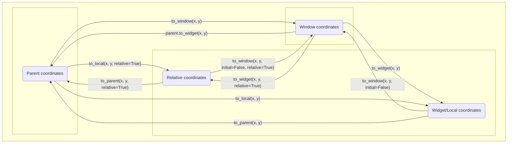

# Kivy Coordinates

Subsections:
- [Defining the coordinate systems](#defining-the-coordinate-systems)
- [Coordinate transformation API](#coordinate-transformation-api)

## Defining the coordinate systems

The `pos` attribute of a Kivy widget refers to the (`x`, `y`) position of the bottom-left corner of that widget. Typically, the origin of this coordinate system is the bottom-left corner of the containing window. Coordinates in this coordinate system are said to be in **window coordinates**. 

However, there are four “special” widgets which change the origin of the coordinate system for their children. These widgets are 

 - RelativeLayout 
 - ScrollView 
 - Scatter 
 - ScatterLayout 

To discuss this in detail, let us introduce the term “parent stack.” For example, if the root kv file of a Kivy application looked like the following: 

```kvlang
BoxLayout: 
    BoxLayout: 
        AnchorLayout: 
            BoxLayout: 
                Widget: 
```
 

Then `Widget`’s parent stack would be `BoxLayout`, `AnchorLayout`, `BoxLayout`, `BoxLayout`. `AnchorLayout`’s parent stack would be `BoxLayout`, `BoxLayout`. Note that the parent stack is ordered. 

Now, if the parent stack of a widget (let’s call it `widget_a`) includes one of the four special widgets, then `widget_a` adopts a new coordinate system. This new coordinate system has an origin located at the bottom-left corner of the first “special” widget in `widget_a`’s parent stack. 

Now we introduce the term **parent coordinates**. The parent coordinates of `widget_a` depend on whether `widget_a` has a special widget in its parent stack.  

 - If `widget_a` does not have a special widget in its parent stack: 
   - Then `widget_a`’s parent coordinates are equivalent to window coordinates. 
 - If `widget_a` has a special widget in its parent stack: 
   - Then the origin of the parent coordinates for `widget_a` is located at the bottom-left corner of the first special widget in `widget_a`’s parent stack. 

**It is crucial to understand that the pos attribute of a widget is in the parent coordinates of that widget.**

The Kivy docs do not mention this, but there is another coordinate system that they use. We will call it **relative coordinates**. The origin of the relative coordinates of `widget_a` is located at the bottom left of `widget_a`. 

Kivy uses one other coordinate system which is referred by two names: **widget coordinates / local coordinates**. The widget/local coordinates of `widget_a` are the parent coordinates of the immediate children of `widget_a` (when we say "immediate children", we are excluding its grandchildren, great-grandchildren, and so on). Most of the time, a widget's widget/local coordinate system is the same as its parent coordinate system. But if a widget is a "special" widget, then its widget/local coordinate system is the same as its relative coordinate system.

Window coordinates are an absolute coordinate system. The position (x, y) in window coordinates is the same point on the screen for every widget in a running application. However, parent coordinates, widget/local coordinates, and relative coordinates are always in reference to a particular widget. In other words, each widget has its own parent, widget/local, and relative coordinate system that may have a different origin from that of another widget. 

In summary:
 - **window coordinates**: The coordinate system whose origin is the bottom left of the application window. This coordinate system is the same for all widgets.
 - **parent coordinates**: Every widget has its own parent coordinates. If `widget_a` has one of the four "special" widgets (RelativeLayout, Scatter, ScatterLayout, ScrollView) in its parent stack, then the origin of the parent coordinates of `widget_a` is located at the bottom left of the first special widget in `widget_a`'s parent stack. If `widget_a` does not have any "special" widgets in its parent stack, then its parent coordinates have the same origin as the application's window coordinates. The `pos` attribute of a widget is in that widget's parent coordinates (as are the `x` and `y` attributes).
 - **relative coordinates**: Every widget has its own relative coordinates. The origin of `widget_a`'s relative coordinates is located at the bottom-left of `widget_a`.
 - **widget/local coordinates**: Every widget has its own widget/local coordinates. The widget/local coordinates of `widget_a` are the parent coordinates of the immediate children of `widget_a`. This means that if `widget_a` is a "special" widget, then the origin of its widget/coordinates is the same as that of its relative coordinates. If `widget_a` is not a "special" widget, then the origin of its widget/local coordinates is the same as its parent coordinates.

## Coordinate transformation API

Every widget has an API for converting positions to different coordinate systems. The methods are defined in the widget class and always take at least two arguments (`x` and `y`). The following image represents the API diagrammatically. A more precise description of the API will follow.



`to_local(x, y, relative=False)` 

 - If `relative` is set to `False` (the default value): 
   - `x`, `y` are assumed to be in the parent coordinates of the widget which calls the method. It returns a tuple that converts this position into widget/local coordinates of the widget which calls the method. 
 
For example, `widget_a.to_local(*widget_a.pos)` converts `widget_a`’s position into its local coordinates. (Remember that the pos attribute of a widget is always in that widget's parent coordinates). 

 - If `relative` is set to `True`: 
   - `x`, `y` are assumed to be in the parent coordinates of the widget which calls the method. Then the returned tuple will be in relative coordinates of the widget which calls the method. 

 

`to_parent(x, y, relative=False)` 

 - If `relative` is set to `False` (the default value): 
   - `x`, `y` are assumed to be in the local coordinates of the widget which calls the method. It returns a tuple that is this position in the parent coordinates of the widget which calls the method. 
 - If `relative` is set to `True`: 
   - `x`, `y` are assumed to be relative coordinates of the widget which calls the method. It returns a tuple that is this position in the parent coordinates of the widget which calls the method. 


`to_widget(x, y, relative=False)`
 - If `relative` is set to `False` (the default value):
   - `x`, `y` are assumed to be in window coordinates. It returns a tuple that is this position in the widget/local coordinates of the widget which calls the method. 
 - If `relative` is set to `True`:
   - `x`, `y` are assumed to be in window coordinates. It returns a tuple that is this position in the relative coordinates of the widget which calls the method.


`to_window(x, y, initial=True, relative=False)`
 - If `initial` is set to `True` (the default value): 
   - `x`, `y` are assumed to be in parent coordinates of the widget which calls the method. It returns a tuple that is this position in window coordinates. 
 - If `initial` is set to `False`: 
   - If `relative` is set to `False` (the default value): 
     - `x`, `y` are assumed to be in widget/local coordinates of the widget which calls the method. It returns a tuple that is this position in window coordinates. 
   - If `relative` is set to `True`: 
     - `x`, `y` are assumed to be in the relative coordinates of the widget which calls the method. It returns a tuple that is this position in window coordinates. 
 - What are we to make of the case where `initial` is `True` and `relative` is `True`? 
   - If we inspect Kivy’s source code, `widget_a.to_window(x, y, initial=True, relative=True)` is equivalent to calling `widget_a.parent.to_window(x, y, initial=False, relative=True)`. 
   - That is, `x`, `y` are assumed to be in the relative coordinates of the direct parent of the widget which calls the method. It returns a tuple that is this position in window coordinates. 
   - Never do this. If you ever need this very specific conversion, just use `widget_a.parent.to_window(x, y, initial=False, relative=True)`, which is more declarative.


`parent.to_widget(x, y)`
 - `x`, `y` are assumed to be in window coordinates. It returns a tuple that converts this position into the parent coordinates of the widget which calls the method.
   - For example, `widget_a.pos = widget_a.parent.to_widget(Window.width/2, Window.height/2)` places the bottom-left corner of `widget_a` in the center of the application.
   - This hack works because, as mentioned before, the widget/local coordinates of a parent has the same origin as the parent coordinates of its child.
   
